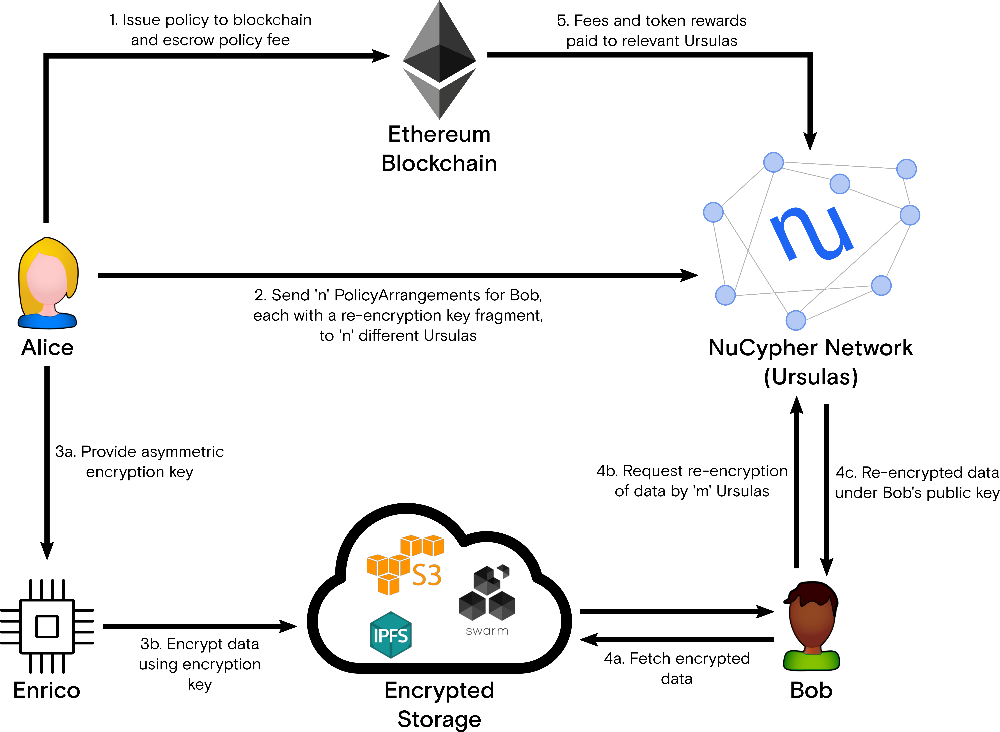

*A decentralized cryptological network offering accessible, intuitive, and extensible runtimes and interfaces for secrets management and dynamic access control.*

----

The NuCypher network provides accessible, intuitive, and extensible runtimes and interfaces
for secrets management and dynamic access control.
* Accessible - The network is permissionless and censorship-resistant.
There are no gate-keepers and anyone can use it.
* Intuitive - The network leverages the classic cryptological narrative of Alice and Bob
(with additional characters where appropriate). This character-based narrative permeates the code-base and helps
developers write safe, misuse-resistant code.
* Extensible - The network currently supports proxy re-encryption but can be extended to provide support for other cryptographic primitives.

Access permissions are baked into the underlying encryption,
and access can only be explicitly granted by the data owner via sharing policies.
Consequently, the data owner has ultimate control over access to their data.
At no point is the data decrypted nor can the underlying private keys be
determined by the NuCypher network.

Under the hood, the NuCypher network uses the [Umbral](https://github.com/nucypher/pyUmbral)
threshold proxy re-encryption scheme to provide cryptographic access control.

# How does NuCypher work?

01. Alice, the data owner, grants access to her encrypted data to
anyone she wants by creating a policy and uploading it to
the NuCypher network.

02. A group of Ursulas, which are nodes on the NuCypher network,
receive information about the policy, called a PolicyArrangement that include
a re-encryption key share. The Ursulas stand ready to re-encrypt data in exchange for payment
in fees and token rewards. Thanks to the use of proxy re-encryption,
Ursulas and the storage layer never have access to Alice's plaintext data.

03. Each policy created by Alice has an associated encryption key, which can be used
by any entity (Enrico) to encrypt data on Alice's behalf.
This entity could be an IoT device in her car, a collaborator assigned
the task of writing data to her policy, or even a third-party creating
data that belongs to her – for example, a lab analyzing medical tests.
The resulting encrypted data can be uploaded to IPFS, Swarm, S3,
or any other storage layer.

04. Bob, a data recipient, obtains the encrypted data from the storage layer and sends an access request
to the NuCypher network. If the policy is satisfied, the data is re-encrypted to his public key
and he can decrypt it with his private key.

05. Ursulas earn fees and token rewards for performing
re-encryption operations.

More detailed information:

- Documentation https://docs.nucypher.com/
- Website https://www.nucypher.com/

# Whitepapers

### Network

[*"NuCypher - A proxy re-encryption network to empower privacy in decentralized systems"*](https://github.com/nucypher/whitepaper/blob/master/whitepaper.pdf)

*by Michael Egorov, David Nuñez, and MacLane Wilkison - NuCypher*

### Economics

[*"NuCypher - Staking Protocol & Economics"*](https://github.com/nucypher/whitepaper/blob/master/economics/staking_protocol/NuCypher_Staking_Protocol_Economics.pdf)

*by Michael Egorov, MacLane Wilkison, Arjun Hassard - NuCypher*

[*"NuCypher - Pricing Protocol & Economics"*](https://github.com/nucypher/whitepaper/blob/master/economics/pricing_protocol/NuCypher_Network__Pricing_Protocol_Economics.pdf)

*by Arjun Hassard - NuCypher*

### Cryptography

[*"Umbral: A Threshold Proxy Re-Encryption Scheme"*](https://github.com/nucypher/umbral-doc/blob/master/umbral-doc.pdf)

*by David Nuñez*

# Getting Involved

NuCypher is a community-driven project and we're very open to outside contributions.

All our development discussions happen in our [Discord server](https://discord.gg/7rmXa3S), where we're happy to answer technical questions, discuss feature requests,
and accept bug reports.

If you're interested in contributing code, please check out our [Contribution Guide](https://docs.nucypher.com/en/latest/support/contribution.html)
and browse our [Open Issues](https://github.com/nucypher/nucypher/issues) for potential areas to contribute.

Get up and running quickly by using our [docker development setup](dev/docker/README.md)

# Security

If you identify vulnerabilities with _any_ nucypher code, please email security@nucypher.com with relevant information to your findings.
We will work with researchers to coordinate vulnerability disclosure between our stakers, partners, and users to ensure successful mitigation of vulnerabilities.

Throughout the reporting process, we expect researchers to honor an embargo period that may vary depending on the severity of the disclosure.
This ensures that we have the opportunity to fix any issues, identify further issues (if any), and inform our users.

Sometimes vulnerabilities are of a more sensitive nature and require extra precautions.
We are happy to work together to use a more secure medium, such as Signal.
Email security@nucypher.com and we will coordinate a communication channel that we're both comfortable with.

A great place to begin your research is by working on our testnet.
Please see our [documentation](https://docs.nucypher.com) to get started.
We ask that you please respect testnet machines and their owners.
If you find a vulnerability that you suspect has given you access to a machine against the owner's permission, stop what you're doing and immediately email security@nucypher.com.
