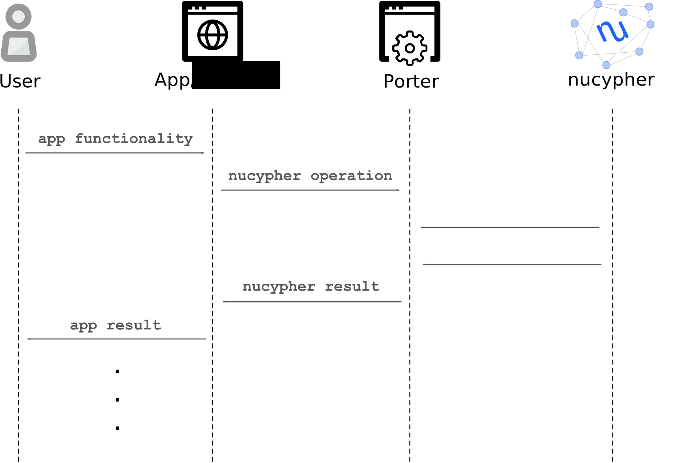

.. _porter:

Porter Service
==============

Overview
--------
NuCypher Porter can be described as the *“Infura for NuCypher”*. Porter is a web-based service that performs
nucypher-based protocol operations on behalf of applications.

Its goal is to simplify and abstract the complexities surrounding the nucypher protocol to negate the need for
applications to interact with it via a python client. Porter introduces the nucypher protocol to cross-platform
functionality including web and mobile applications. By leveraging ``rust-umbral`` and its associated javascript
bindings for cryptography, and Porter for communication with the network, a lightweight, richer and full-featured
web and mobile experience is accessible to application developers.

Running Porter
--------------

.. note::

    If running the Porter service using Docker or Docker Compose, it will run on port 80 (HTTP) or 443 (HTTPS). If
    running via the CLI the default port is 9155, unless specified otherwise via the ``--http-port`` option.

Security
^^^^^^^^

HTTPS
+++++
To run the Porter service over HTTPS, it will require a TLS key (``--tls-key-filepath`` option) and a TLS certificate.

If desired, keys and self-signed certificates can be created for the localhost using the ``openssl`` command:

.. code:: bash

    $ openssl req -x509 -out cert.pem -keyout key.pem \
      -newkey rsa:2048 -nodes -sha256 \
      -subj '/CN=localhost' -extensions EXT -config <( \
        printf "[dn]\nCN=localhost\n[req]\ndistinguished_name = dn\n[EXT]\nsubjectAltName=DNS:localhost\nkeyUsage=digitalSignature\nextendedKeyUsage=serverAuth")

.. important::

    Self-signed certificates are not recommended, other than for testing.

Authentication
++++++++++++++
Porter will allow the configuration of Basic Authentication out of the box via
an `htpasswd <https://httpd.apache.org/docs/2.4/programs/htpasswd.html>`_ file. The use of Basic Authentication
necessitates HTTPS since user credentials will be passed over the network as cleartext.

Alternative authentication mechanisms can be implemented outside of Porter via an intermediary proxy service, for
example an Nginx HTTPS reverse proxy.

via Docker
^^^^^^^^^^

Run Porter within Docker without acquiring or installing the ``nucypher`` codebase.

#. Get the latest ``nucypher`` image:

   .. code:: bash

       $ docker pull nucypher/porter:latest

#. Run Porter service

   For HTTP service (on default port 80):

   .. code:: bash

       $ docker run -d --rm \
          --name porter-http \
          -v ~/.local/share/nucypher/:/root/.local/share/nucypher \
          -p 80:9155 \
          nucypher/porter:latest \
          nucypher porter run \
          --provider <YOUR WEB3 PROVIDER URI> \
          --network <NETWORK NAME>

   For HTTPS service (on default port 443):

   * Without Basic Authentication:

     .. code:: bash

         $ docker run -d --rm \
            --name porter-https \
            -v ~/.local/share/nucypher/:/root/.local/share/nucypher \
            -v <TLS DIRECTORY>:/etc/porter/tls \
            -p 443:9155 \
            nucypher/porter:latest \
            nucypher porter run \
            --provider <YOUR WEB3 PROVIDER URI> \
            --network <NETWORK NAME> \
            --tls-key-filepath /etc/porter/tls/<KEY FILENAME> \
            --tls-certificate-filepath /etc/porter/tls/<CERT FILENAME>

   * With Basic Authentication:

     .. code:: bash

         $ docker run -d --rm \
            --name porter-https-auth \
            -v ~/.local/share/nucypher/:/root/.local/share/nucypher \
            -v <TLS DIRECTORY>:/etc/porter/tls \
            -v <HTPASSWD FILE>:/etc/porter/auth/htpasswd \
            -p 443:9155 \
            nucypher/porter:latest \
            nucypher porter run \
            --provider <YOUR WEB3 PROVIDER URI> \
            --network <NETWORK NAME> \
            --tls-key-filepath /etc/porter/tls/<KEY FILENAME> \
            --tls-certificate-filepath /etc/porter/tls/<CERT FILENAME> \
            --basic-auth-filepath /etc/porter/auth/htpasswd

   The ``<TLS DIRECTORY>`` is expected to contain the TLS key file (``<KEY FILENAME>``) and the
   certificate (``<CERT FILENAME>``) to run Porter over HTTPS.

#. Porter will be available on default ports 80 (HTTP) or 443 (HTTPS). The porter service running will be one of
   the following depending on the mode chosen:

   * ``porter-http``
   * ``porter-https``
   * ``porter-https-auth``

#. View Porter logs

   .. code:: bash

       $ docker logs -f <PORTER SERVICE>

#. Stop Porter service

   .. code:: bash

       $ docker stop <PORTER SERVICE>

via Docker Compose
^^^^^^^^^^^^^^^^^^

Docker Compose will start the Porter service within a Docker container.

#. Acquire the ``nucypher`` codebase - see :ref:`acquire_codebase`. There is no need
   to install ``nucypher`` after acquiring the codebase since Docker will be used.

#. Set the required environment variables:

   * Web3 Provider URI environment variable

     .. code:: bash

         $ export WEB3_PROVIDER_URI=<YOUR WEB3 PROVIDER URI>

     .. note::

         Local ipc is not supported when running via Docker.

   * Network Name environment variable

     .. code:: bash

         $ export NUCYPHER_NETWORK=<NETWORK NAME>

   * *(Optional)* TLS directory variable containing the TLS key and the certificate to run Porter over HTTPS. The directory is expected to contain two files:

     * ``key.pem`` - the TLS key
     * ``cert.pem`` - the TLS certificate

     Set the TLS directory environment variable

     .. code:: bash

         $ export TLS_DIR=<ABSOLUTE PATH TO TLS DIRECTORY>

   * *(Optional)* Filepath to the htpasswd file for Basic Authentication

     Set the htpasswd filepath environment variable

     .. code:: bash

         $ export HTPASSWD_FILE=<ABSOLUTE PATH TO HTPASSWD FILE>

#. Run Porter service

   For HTTP service (on default port 80):

   .. code:: bash

       $ docker-compose -f deploy/docker/porter/docker-compose.yml up -d porter-http

   For HTTPS service (on default port 443):

   * Without Basic Authentication

     .. code:: bash

         $ docker-compose -f deploy/docker/porter/docker-compose.yml up -d porter-https

   * With Basic Authentication

     .. code:: bash

         $ docker-compose -f deploy/docker/porter/docker-compose.yml up -d porter-https-auth

#. Porter will be available on default ports 80 (HTTP) or 443 (HTTPS). The porter service running will be one of
   the following depending on the mode chosen:

   * ``porter-http``
   * ``porter-https``
   * ``porter-https-auth``

#. View Porter logs

   .. code:: bash

       $ docker-compose -f deploy/docker/porter/docker-compose.yml logs -f <PORTER SERVICE>

#. Stop Porter service

   .. code:: bash

       $ docker-compose -f deploy/docker/porter/docker-compose.yml down

via CLI
^^^^^^^

Install ``nucypher`` - see :doc:`/references/pip-installation`.

For a full list of CLI options, run:

.. code:: console

  $ nucypher porter run --help

* Run Porter service

  * Run via HTTP

    .. code:: console

        $ nucypher porter run --provider <YOUR WEB3 PROVIDER URI> --network <NETWORK NAME>

         ______
        (_____ \           _
        _____) )__   ____| |_  ____  ____
        |  ____/ _ \ / ___)  _)/ _  )/ ___)
        | |   | |_| | |   | |_( (/ /| |
        |_|    \___/|_|    \___)____)_|

        the Pipe for nucypher network operations

        Reading Latest Chaindata...
        Network: <NETWORK NAME>
        Provider: ...
        Running Porter Web Controller at http://127.0.0.1:9155

  * Run via HTTPS

    To run via HTTPS use the ``--tls-key-filepath`` and ``--tls-certificate-filepath`` options:

    .. code:: console

        $ nucypher porter run --provider <YOUR WEB3 PROVIDER URI> --network <NETWORK NAME> --tls-key-filepath <TLS KEY FILEPATH> --tls-certificate-filepath <CERT FILEPATH>

        ______
        (_____ \           _
        _____) )__   ____| |_  ____  ____
        |  ____/ _ \ / ___)  _)/ _  )/ ___)
        | |   | |_| | |   | |_( (/ /| |
        |_|    \___/|_|    \___)____)_|

        the Pipe for nucypher network operations

        Reading Latest Chaindata...
        Network: <NETWORK NAME>
        Provider: ...
        Running Porter Web Controller at https://127.0.0.1:9155

    For HTTPS with Basic Authentication, add the ``--basic-auth-filepath`` option:

    .. code:: console

        $ nucypher porter run --provider <YOUR WEB3 PROVIDER URI> --network <NETWORK NAME> --tls-key-filepath <TLS KEY FILEPATH> --tls-certificate-filepath <CERT FILEPATH> --basic-auth-filepath <HTPASSWD FILE>

        ______
        (_____ \           _
        _____) )__   ____| |_  ____  ____
        |  ____/ _ \ / ___)  _)/ _  )/ ___)
        | |   | |_| | |   | |_( (/ /| |
        |_|    \___/|_|    \___)____)_|

        the Pipe for nucypher network operations

        Reading Latest Chaindata...
        Network: <NETWORK NAME>
        Provider: ...
        Basic Authentication enabled
        Running Porter Web Controller at https://127.0.0.1:9155

API
---

Status Codes
^^^^^^^^^^^^
All documented API endpoints use JSON and are REST-like.

Some common returned status codes you may encounter are:

- ``200 OK`` -- The request has succeeded.
- ``400 BAD REQUEST`` -- The server cannot or will not process the request due to something that is perceived to
  be a client error (e.g., malformed request syntax, invalid request message framing, or deceptive request routing).
- ``401 UNAUTHORIZED`` -- Authentication is required and the request has failed to provide valid authentication credentials.
- ``500 INTERNAL SERVER ERROR`` -- The server encountered an unexpected condition that prevented it from
  fulfilling the request.

Typically, you will want to ensure that any given response results in a 200 status code.
This indicates that the server successfully completed the call.

If a 400 status code is returned, double-check the request data being sent to the server. The text provided in the
error response should describe the nature of the problem.

If a 401 status code is returned, ensure that valid authentication credentials are being used in the request e.g. if
Basic authentication is enabled.

If a 500 status code, note the reason provided. If the error is ambiguous or unexpected, we'd like to
know about it! The text provided in the error response should describe the nature of the problem.

For any bugs/un expected errors, see our :ref:`Contribution Guide <contribution-guide>` for issue reporting and
getting involved. Please include contextual information about the sequence of steps that caused the 500 error in the
GitHub issue. For any questions, message us in our `Discord <https://discord.gg/7rmXa3S>`_.

URL Query Parameters
^^^^^^^^^^^^^^^^^^^^
All parameters can be passed as either JSON data within the request or as query parameter strings in the URL.
Query parameters used within the URL will need to be URL encoded e.g. ``/`` in a base64 string becomes ``%2F`` etc.

For ``List`` data types to be passed via a URL query parameter, the value should be provided as a comma-delimited
String. For example, if a parameter is of type ``List[String]`` either a JSON list of Strings can be provided e.g.

.. code:: bash

    curl -X GET <PORTER URI>/<ENDPOINT> \
        -H "Content-Type: application/json" \
        -d '{"parameter_with_list_of_values": ["value1", "value2", "value3"]}'

OR it can be provided via a URL query parameter

.. code:: bash

    curl -X GET <PORTER URI>/<ENDPOINT>?parameter_with_list_of_values=value1,value2,value3

More examples shown below.

.. important::

    If URL query parameters are used and the URL becomes too long, the request will fail. There is no official limit
    and it is dependent on the tool being used.

GET /get_ursulas
^^^^^^^^^^^^^^^^
Sample available Ursulas for a policy as part of Alice's ``grant`` workflow. Returns a list of Ursulas
and their associated information that is used for the policy.

Parameters
++++++++++
+----------------------------------+---------------+-----------------------------------------------+
| **Parameter**                    | **Type**      | **Description**                               |
+==================================+===============+===============================================+
| ``quantity``                     | Integer       | Number of total Ursulas to return.            |
+----------------------------------+---------------+-----------------------------------------------+
| ``duration_periods``             | Integer       | Number of periods required for the policy.    |
+----------------------------------+---------------+-----------------------------------------------+
| ``include_ursulas`` *(Optional)* | List[Strings] | | List of Ursula checksum addresses to        |
|                                  |               | | give preference to. If any of these Ursulas |
|                                  |               | | are unavailable, they will not be included  |
|                                  |               | | in result.                                  |
+----------------------------------+---------------+-----------------------------------------------+
| ``exclude_ursulas`` *(Optional)* | List[Strings] | | List of Ursula checksum addresses to not    |
|                                  |               | | include in the result.                      |
+----------------------------------+---------------+-----------------------------------------------+

Returns
+++++++
List of Ursulas with associated information:

    * ``encrypting_key`` - Ursula's encrypting key encoded as hex
    * ``checksum_address`` - Ursula's checksum address
    * ``uri`` - Ursula's URI

Example Request
+++++++++++++++
.. code:: bash

    curl -X GET <PORTER URI>/get_ursulas \
        -H "Content-Type: application/json" \
        -d '{"quantity": 5,
             "duration_periods": 4,
             "include_ursulas": ["0xB04FcDF9327f65AB0107Ea95b78BB200C07FA752"],
             "exclude_ursulas": ["0x5cF1703A1c99A4b42Eb056535840e93118177232", "0x9919C9f5CbBAA42CB3bEA153E14E16F85fEA5b5D"]}'

OR

.. code:: bash

    curl -X GET "<PORTER URI>/get_ursulas?quantity=5&duration_periods=4&include_ursulas=0xB04FcDF9327f65AB0107Ea95b78BB200C07FA752&exclude_ursulas=0x5cF1703A1c99A4b42Eb056535840e93118177232,0x9919C9f5CbBAA42CB3bEA153E14E16F85fEA5b5D"

Example Response
++++++++++++++++
.. code::

    Status: 200 OK

.. code:: json

    {
       "result": {
          "ursulas": [
             {
                "encrypting_key": "025a335eca37edce8191d43c156e7bc6b451b21e5258759966bbfe0e6ce44543cb",
                "checksum_address": "0x5cF1703A1c99A4b42Eb056535840e93118177232",
                "uri": "https://3.236.144.36:9151"
             },
             {
                "encrypting_key": "02b0a0099ee180b531b4937bd7446972296447b2479ca6259cb6357ed98b90da3a",
                "checksum_address": "0x7fff551249D223f723557a96a0e1a469C79cC934",
                "uri": "https://54.218.83.166:9151"
             },
             {
                "encrypting_key": "02761c765e2f101df39a5f680f3943d0d993ef9576de8a3e0e5fbc040d6f8c15a5",
                "checksum_address": "0x9C7C824239D3159327024459Ad69bB215859Bd25",
                "uri": "https://92.53.84.156:9151"
             },
             {
                "encrypting_key": "0258b7c79fe73f3499de91dd5a5341387184035d0555b10e6ac762d211a39684c0",
                "checksum_address": "0x9919C9f5CbBAA42CB3bEA153E14E16F85fEA5b5D",
                "uri": "https://3.36.66.164:9151"
             },
             {
                "encrypting_key": "02e43a623c24db4f62565f82b6081044c1968277edfdca494a81c8fd0826e0adf6",
                "checksum_address": "0xfBeb3368735B3F0A65d1F1E02bf1d188bb5F5BE6",
                "uri": "https://128.199.124.254:9151"
             }
          ]
       },
       "version": "6.0.0"
    }

POST /publish_treasure_map
^^^^^^^^^^^^^^^^^^^^^^^^^^
Publish a treasure map to the network as part of Alice's ``grant`` workflow. The treasure map associated
with the policy is stored by the network.

Parameters
++++++++++
+----------------------------------+---------------+----------------------------------------+
| **Parameter**                    | **Type**      | **Description**                        |
+==================================+===============+========================================+
| ``treasure_map``                 | String        | Treasure map bytes encoded as base64.  |
+----------------------------------+---------------+----------------------------------------+
| ``bob_encrypting_key``           | String        | Bob's encrypting key encoded as hex.   |
+----------------------------------+---------------+----------------------------------------+

Returns
+++++++
Confirmation that the treasure map was published:

    * ``published`` - Value of ``true``.

If publishing the treasure map fails, an error status code is returned.

Example Request
+++++++++++++++
.. code:: bash

    curl -X POST <PORTER URI>/publish_treasure_map \
        -H "Content-Type: application/json" \
        -d '{"treasure_map": "Qld7S8sbKFCv2B8KxfJo4oxiTOjZ4VPyqTK5K1xK6DND6TbLg2hvlGaMV69aiiC5QfadB82w/5q1Sw+SNFHN2e ...",
             "bob_encrypting_key": "026d1f4ce5b2474e0dae499d6737a8d987ed3c9ab1a55e00f57ad2d8e81fe9e9ac"}'

OR

.. code:: bash

    curl -X POST "<PORTER URI>/publish_treasure_map?treasure_map=Qld7S8sbKFCv2B8KxfJo4oxiTOjZ4VPyqTK5K1xK6DND6TbLg2hvlGaMV69aiiC5QfadB82w%2F5q1Sw%2BSNFHN2e ...&bob_encrypting_key=026d1f4ce5b2474e0dae499d6737a8d987ed3c9ab1a55e00f57ad2d8e81fe9e9ac"

Example Response
++++++++++++++++
.. code::

    Status: 200 OK

.. code:: json

    {
       "result": {
          "published": true
       },
       "version": "6.0.0"
    }

GET /get_treasure_map
^^^^^^^^^^^^^^^^^^^^^
Retrieve a treasure map from the network as part of Bob's ``retrieve`` workflow. Bob needs to obtain the treasure map
associated with a policy, to learn which Ursulas were assigned to service the policy.

Parameters
++++++++++
+----------------------------------+---------------+----------------------------------------+
| **Parameter**                    | **Type**      | **Description**                        |
+==================================+===============+========================================+
| ``treasure_map_id``              | String        | Treasure map identifier.               |
+----------------------------------+---------------+----------------------------------------+
| ``bob_encrypting_key``           | String        | Bob's encrypting key encoded as hex.   |
+----------------------------------+---------------+----------------------------------------+

Returns
+++++++
The requested treasure map:

    * ``treasure_map`` - Treasure map bytes encoded as base64

Example Request
+++++++++++++++
.. code:: bash

    curl -X GET <PORTER URI>/get_treasure_map \
        -H "Content-Type: application/json" \
        -d '{"treasure_map_id": "f6ec73c93084ce91d5542a4ba6070071f5565112fe19b26ae9c960f9d658903a",
             "bob_encrypting_key": "026d1f4ce5b2474e0dae499d6737a8d987ed3c9ab1a55e00f57ad2d8e81fe9e9ac"}'

OR

.. code:: bash

    curl -X GET "<PORTER URI>/get_treasure_map?treasure_map_id=f6ec73c93084ce91d5542a4ba6070071f5565112fe19b26ae9c960f9d658903a&bob_encrypting_key=026d1f4ce5b2474e0dae499d6737a8d987ed3c9ab1a55e00f57ad2d8e81fe9e9ac"

Example Response
++++++++++++++++
.. code::

    Status: 200 OK

.. code:: json

    {
       "result": {
          "treasure_map": "Qld7S8sbKFCv2B8KxfJo4oxiTOjZ4VPyqTK5K1xK6DND6TbLg2hvlGaMV69aiiC5QfadB82w/5q1Sw+SNFHN2esWgAbs38QuUVUGCzDoWzQAAAGIAuhw12ZiPMNV8LaeWV8uUN+au2HGOjWilqtKsaP9fmnLAzFiTUAu9/VCxOLOQE88BPoWk1H7OxRLDEhnBVYyflpifKbOYItwLLTtWYVFRY90LtNSAzS8d3vNH4c3SHSZwYsCKY+5LvJ68GD0CqhydSxCcGckh0unttHrYGSOQsURUI4AAAEBsSMlukjA1WyYA+FouqkuRtk8bVHcYLqRUkK2n6dShEUGMuY1SzcAbBINvJYmQp+hhzK5m47AzCl463emXepYZQC/evytktG7yXxd3k8Ak+Qr7T4+G2VgJl4YrafTpIT6wowd+8u/SMSrrf/M41OhtLeBC4uDKjO3rYBQfVLTpEAgiX/9jxB80RtNMeCwgcieviAR5tlw2IlxVTEhxXbFeopcOZmfEuhVWqgBUfIakqsNCXkkubV0XS2l5G1vtTM8oNML0rP8PyKd4+0M5N6P/EQqFkHH93LCDD0IQBq9usm3MoJp0eT8N3m5gprI05drDh2xe/W6qnQfw3YXnjdvf2A="
       },
       "version": "6.0.0"
    }

POST /exec_work_order
^^^^^^^^^^^^^^^^^^^^^
Use a work order to execute a re-encrypt operation on the network network as part of Bob's ``retrieve`` workflow.

Parameters
++++++++++
+----------------------------------+---------------+----------------------------------------+
| **Parameter**                    | **Type**      | **Description**                        |
+==================================+===============+========================================+
| ``ursula``                       | String        | | Checksum address corresponding to    |
|                                  |               | | the Ursula to execute the work order.|
+----------------------------------+---------------+----------------------------------------+
| ``work_order_payload``           | String        | Work order payload encoded as base64.  |
+----------------------------------+---------------+----------------------------------------+

Returns
+++++++
The result of the re-encryption operation performed on the work order payload:

    * ``work_order_result`` - The result of the re-encryption operation returning combined cFrag and
      associated signature bytes encoded as base64, i.e. it is of the format
      ``base64(<cfrag_1> || <cfrag_1_signature> || <cfrag_2> || <cfrag_2_signature> ...)``.

Example Request
+++++++++++++++
.. code:: bash

    curl -X POST <PORTER URI>/exec_work_order \
        -H "Content-Type: application/json" \
        -d '{"ursula": "0xE57bFE9F44b819898F47BF37E5AF72a0783e1141",
             "work_order_payload": "QoQgOCRvtT4qG0nb5eDbfJ3vO6jMeoy9yp7lvezWKyNF0I6f/uQBPJed9FM7oc7jDAzqyDYD1C/1Cnab+kdobAJT7a3Z/KcOot4SwhgZ0eLGYVuhiAnXP9F7lBDosmvd2gAAAAAAAAAAAAAAAAAAAAAAAAAAAAAAAAAAAAAAAAAAA1I8O2JB/65y0K6m0dxmCpYJfsbpV63dMqcmTTPZAuWuA6LDyDa9JOqPF1OYQWHYi93wNLVLyHCLH6UEf5JOSgmgZOCPIzOaUpQMlr1rIDGExrF6zrLGpAwpPMMOzqa8tjiWHFaHWyLsUMyVKT8v1Psa/iIQ4NZDG+gKDSjgp33MbLml/ti+1p75M2ewuUbCjCWq5Mkf5ycqyEQUMt0IcTgNA6vxewmaBt7UTsYaUzkeTkNz/hLO9+ZFJ1NzJLxeweSqAiNQtfBvG7Fih6oaQT9uslu4QAwOTgolqkinEsoNx9XRL8Ocb8pO/5POBfPxiH8c2v5lrr6HhkAKAC5QODfegIToy29k0KIf3bCoqaVYncvjLJcum0AatnyOkYoV9Zf5wojvyFJE+MZ/homke4Yd8irUdoLSgxDuEDtyRNMuTpcHA37Z+npgp/zi0DQUvK35xZE+DmGYhaHTOPQesiTqyJc/Az22wtTfA3n9JwjSl6CjADGjHWgUPMQWzW8fqICo1iek2z7oFHM24yCtyvsEbC2Mm25LEZi/k2mfbgpNRg5PqW9qj/hTK19Cm4s0rlK7e2odCD5T3Iy0s6eg0KgR0RhT/ayH42be1FHgXFBFeABhm0fM8ZxorhMF1ce/yDPOaRZ8"}'

OR

.. code:: bash

    curl -X POST "<PORTER URI>/exec_work_order?ursula=0xE57bFE9F44b819898F47BF37E5AF72a0783e1141&work_order_payload=QoQgOCRvtT4qG0nb5eDbfJ3vO6jMeoy9yp7lvezWKyNF0I6f%2FuQBPJed9FM7oc7jDAzqyDYD1C%2F1Cnab%2BkdobAJT7a3Z%2FKcOot4SwhgZ0eLGYVuhiAnXP9F7lBDosmvd2gAAAAAAAAAAAAAAAAAAAAAAAAAAAAAAAAAAAAAAAAAAA1I8O2JB%2F65y0K6m0dxmCpYJfsbpV63dMqcmTTPZAuWuA6LDyDa9JOqPF1OYQWHYi93wNLVLyHCLH6UEf5JOSgmgZOCPIzOaUpQMlr1rIDGExrF6zrLGpAwpPMMOzqa8tjiWHFaHWyLsUMyVKT8v1Psa%2FiIQ4NZDG%2BgKDSjgp33MbLml%2Fti%2B1p75M2ewuUbCjCWq5Mkf5ycqyEQUMt0IcTgNA6vxewmaBt7UTsYaUzkeTkNz%2FhLO9%2BZFJ1NzJLxeweSqAiNQtfBvG7Fih6oaQT9uslu4QAwOTgolqkinEsoNx9XRL8Ocb8pO%2F5POBfPxiH8c2v5lrr6HhkAKAC5QODfegIToy29k0KIf3bCoqaVYncvjLJcum0AatnyOkYoV9Zf5wojvyFJE%2BMZ%2Fhomke4Yd8irUdoLSgxDuEDtyRNMuTpcHA37Z%2Bnpgp%2Fzi0DQUvK35xZE%2BDmGYhaHTOPQesiTqyJc%2FAz22wtTfA3n9JwjSl6CjADGjHWgUPMQWzW8fqICo1iek2z7oFHM24yCtyvsEbC2Mm25LEZi%2Fk2mfbgpNRg5PqW9qj%2FhTK19Cm4s0rlK7e2odCD5T3Iy0s6eg0KgR0RhT%2FayH42be1FHgXFBFeABhm0fM8ZxorhMF1ce%2FyDPOaRZ8"

Example Response
++++++++++++++++
.. code::

    Status: 200 OK

.. code:: json

    {
       "result": {
          "work_order_result": "AAABpwIE30NxwNdRKKYbQ8g0/smtFuDoTPy8wrkJykX80A4LKAMQ4B9nUoyq9JHyDvnLXf314LrLA4roe/HuUXXNsF+6muWUZPwe8IA/SwkPJnpggGu0xQdVl3eMGpgHYL9pW3jWA0ztwFmQ6qpgJkXxdkK7j62kBSjzWTziWRaWzgd0bXRqA71fJSvQp/q2V5do3/g2BvqN8R22ZBxzn0s77p0s7LyIA+K1a1aMbR22OtpGdmUTbl3SK7gSYAVsHtpBbvok/FstA78AbixycMh5OgOXze62RMFXFvNeK5aw8vld0YefHkoWA+4YKNw8zddlhhH4jv8gXKxZQcdxA4tpxYiigTFuJFb4B/WzU9MEvZQUDfVVxtAgtpyTQaw+EFVc313bFrPjfZIhbodl2FBSa8HHbyU+zyuQbx3xIUcTXrkWCLV7+J6mrvjrJkGWH+AJAceN8P7uPvK101P5OKs6oiO1/voDPIOr0boQB6pE+gHGH56Eb8Q3W5uGJ9p2e2Ul90vMFRmMRLVvHToNrMgrMOLNa/TenaiAxK+xfiOnNNE0Mi3LQTAj0c+mTLM1fZ81zIgT0yQXJzfKfiiJuAN35e1JlgYISnxchLqv6gYldeRxx1Xz2v5TZtTvRjlP9PCEEaW4sQaqW+0AAAGnAghcC66v3rlE4nN8utPifyLlG6dwwg25KVfTwfjiqOagAsrrQEi1CHnTyFl50DSruaygVnPj+sCv/G9onIExiRv6dcjhZhASDM/2P67XlNiwn074GI5f8e1orNVcVXpvS+0DzdQxL+pbkmNDH6XkZjbAyYcJ+B8zPtcMeIlEhPEJz7ICxJ0agnJr6DgGNvsNXeGSDQWVHRAwPlTOvvh0lZnOvnICfMParvaZkDVft9z4x7HUTuvkJmEnp1qAGefyDx57MzACBbvqNTHVDhv4qDmfe0ynjIKO+1bYT8G4s7xmgmS9y8ECOO+/cX1z9MgijH4wZLG36kJq50BXXOU7U5yRvzQe4R0W2noI4lfmPg3bTqXQyZrvINVImvwuyvQMoQTDM9HFM4dUyN4vLDpSe3bHZmpTIpI8VtOMNUAo+wGzfBMEsSPAxJ/fOZCL33HTMIe0p+q4F9ksDNxO3XFHwEuMm2FuSRuQbnKUtxqXp4YiDdF2PKPKthfZ7WUZN+Z+wAjMzwE28Bf3m5SGZsXDQxaKTioWJUxDbzdHnpcI28+4srZVr2SU6GKR5yGDrAJxLf2Of4+UHK/UNakH45bWJfYq6Rr+iWe0aFHDtQHqkBtWWmvWJBLhyzsXnqBUhyKQr3DEZ3/R0wAAAacCq+RZNiJQx5WYQLVnrQefNU+A55LL75iRMOJRxukGlEoD5D30UIArtCv4d+iN6XLZhEM6Jsqg5ltPWfFZyRzHbb+StN+TFlQ/LDnFRPQ0MQpGMDjGckCqklZdn0NUGDkTcgOmyY2bhoGcgkob3QvlhSOYS/LPLRCnyn5fn0kABoNKagKuITPL9Tmg87k+yK9PQFu9P3cAOCvL/ZUPJSKI5r47HANuLdqh4zhfyAe5PW3qi7GnzRXRySA+6lImyD/nWqbb2gNv9MYrA2ioheO5jXA2uArwgZObnLApPsIc7Jwl1ko7KgJXN+EsBMdBHwz2Ps6LJt9z73y/HnuivgSNkssxZ8pIXqk9NGRwgBhP2DW0Ctl30bRNX6SIEcD/b0yzsfKIUQk3L7QwPYxE9iKicz608hLzrCUwmHoa8oWA/9dQks8KBD1tTrm0KM5fJcXonZHzeDFIYcHMDMu1PJkwFsLWRVTXJJBgDMUQJix9mpb3px0jMPjAZuDlpherQsLNNRQJq75pVu7hyKmeDAPBGhBNND2NxB3pg3RrFhShdosjpRP/gCJhuI0IdAnajYCG+vmIilyS/8oZomMEg6b8KChUOPVkp/VPFXUKow4jzLXjf7R9DJM/41Yn5ut7IaLi37X/jwwa"
       },
       "version": "6.0.0"
    }
