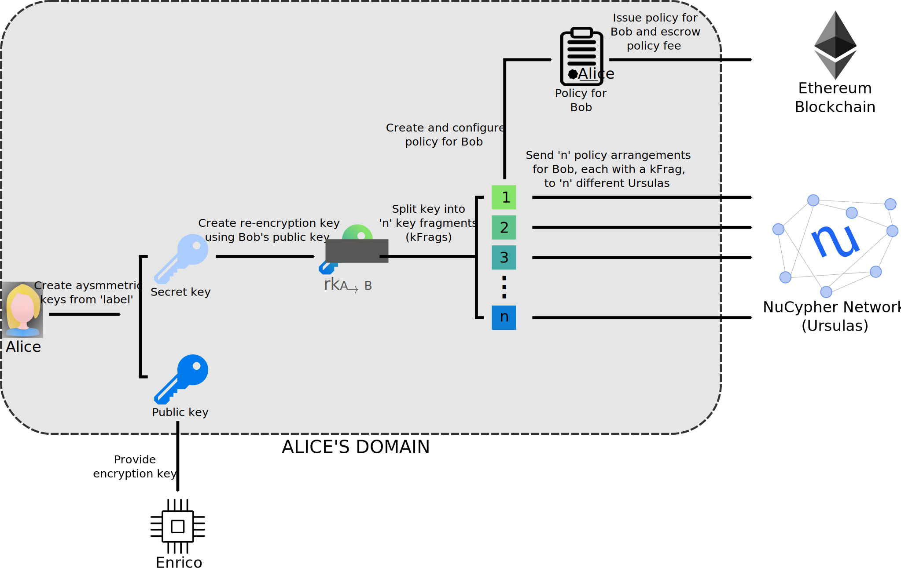
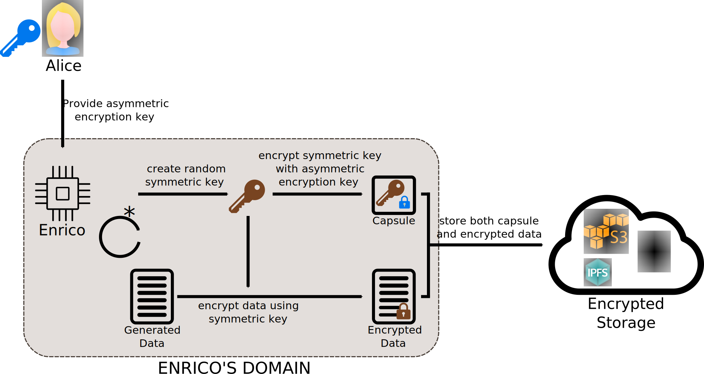
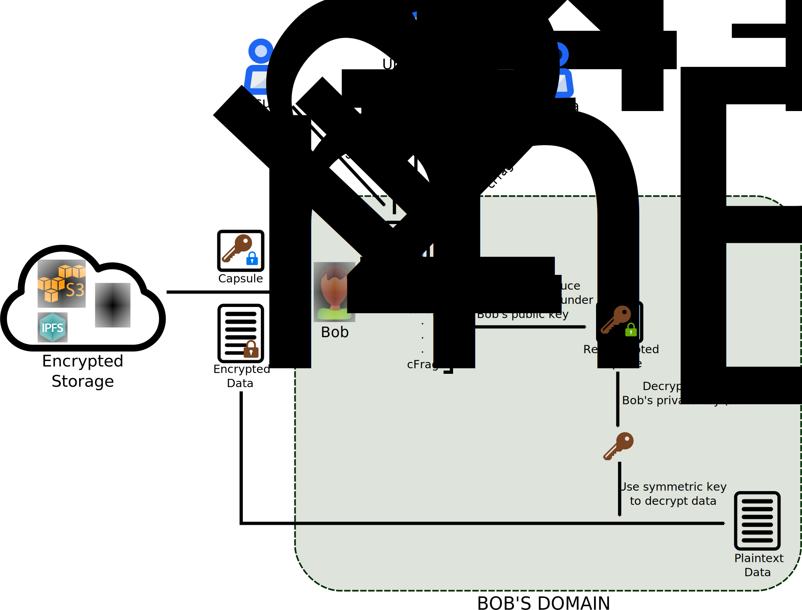
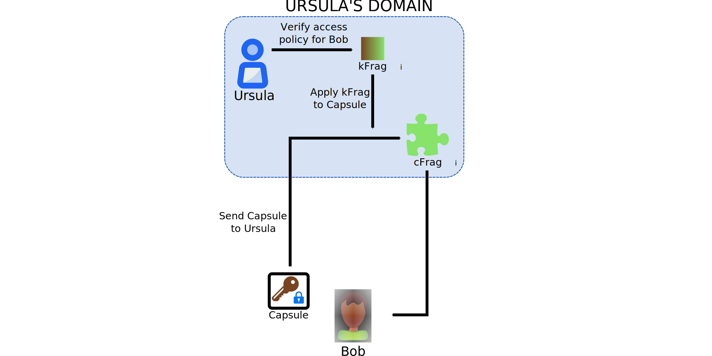

.. _character-concepts:

Character Concepts
==================

NuCypher's API is written as characters within a cryptological narrative/archetype, each fulfilling a particular
role.

* **Alice**:  *"The Data Owner"* - retains full control over the data encrypted for her and determines whom to share the data with
* **Enrico**: *"The Encryptor"* - a data source that encrypts data on behalf of Alice
* **Bob**:    *"The Data Recipient"* - the data recipient that Alice intends to share data with
* **Ursula**: *"The Proxy in PRE"* - the nodes on the NuCypher Network that stand ready to re-encrypt data in exchange for payment in fees and token rewards; they enforce the access policy created by Alice

.. _Umbral: https://github.com/nucypher/umbral-doc/blob/master/umbral-doc.pdf

Character Actions
-----------------

Alice::Grant
^^^^^^^^^^^^

Alice has data that she wants to share and she wants to classify/categorize
her data according to how she intends to share it. These subsets of data would have their own set of permissions - within NuCypher
this concept is called a `label`. Alice uses this `label`  to categorize data and she creates an asymmetric encryption key
for Enrico characters based on the `label`. For example, Alice may use different `labels` and different Enricos for
health data, personal data, and work-related data. Essentially, `labels` are a way to categorize data for sharing - you
can think of file system folders as being somewhat analogous to `labels`. Alice can delegate access permissions to
the encrypted data classified under a `label` to any recipient she sees fit.

The same encryption key can be used by Enrico even though multiple policies for the data can be created
for different Bobs. Enrico, therefore, only has to encrypt data using the provided encryption key
and data can later be re-encrypted for all Bobs who have been granted access.

When Alice wants to share this information with Bob, she can create a
policy in the NuCypher Network to grant access to him. To grant access to Bob, Alice must:

#. Create a re-encryption key based on the asymmetric private key and Bob's public key
#. Configure the conditions of the policy e.g. *expiration time, m-of-n threshold values*
#. Deploy the policy including associated fees to the blockchain
#. Deploy `n` policy arrangements, each containing a re-encryption key fragment, `kFrag`, to `n` nodes on the NuCypher Network

Enrico::Encrypt
^^^^^^^^^^^^^^^

The NuCypher Network uses the Umbral_ threshold proxy re-encryption scheme which employs a key encapsulation mechanism (KEM)/data
encapsulation mechanism (DEM). In this approach, an ephemeral symmetric key is used to encrypt the data, and the
symmetric key is encrypted using an asymmetric encryption key. The encrypted data (the DEM portion) and the
encrypted symmetric key (the KEM portion, called a `capsule`) are stored together.

Even though different blocks of newly generated bulk data may use different symmetric keys, the same asymmetric
encryption key provided by Alice is used to encrypt the symmetric key. How and when Enrico uses a new symmetric key
is up to the user of the Enrico API.

Bob::Retrieve
^^^^^^^^^^^^^

When Bob wants to access the data, he must first obtain the encrypted data and `capsule` from encrypted storage.
However, this data is currently encrypted and inaccessible to Bob.

In order to gain access, Bob must request re-encryption of the `capsule` by the `n` Ursulas that Alice previously
distributed `kFrags` to. Remember that when Alice granted access to Bob, she distributed `n`
`kFrags` of a re-encryption key for Bob to `n` Ursulas on the network. Therefore, Bob sends his `capsule` to `n`
Ursulas in the NuCypher Network that have a corresponding `kFrag` for that policy. Those Ursulas
will use their `kFrag` to perform a partial re-encryption operation on the `capsule` and produce a corresponding
ciphertext fragment, `cFrag`. In the same way a `kFrag` is a fragment of a key, a `cFrag` is a fragment of ciphertext.
The `cFrag` is returned to Bob, who collects `cFrags` until he obtains a threshold, `m`, number of `cFrags`.
Bob attaches `m` received `cFrags` to the original `capsule` to obtain the fully re-encrypted `capsule` that is now
encrypted under his public key. Note that the generation of a complete re-encrypted `capsule` is possible from a
smaller number of `cFrags` than the number of `kFrags` originally sent out to Ursulas (m-of-n threshold scheme). Bob
can now decrypt the `capsule` to obtain the symmetric key originally used to encrypt the bulk data.

Once Bob has the symmetric key, he can use it to decrypt the bulk data. This process can be repeated as more data is
shared with Bob that is associated with `label` for the policy.

Ultimately, because of the KEM/DEM approach, only the `capsule` needs to be re-encrypted for Bob.
Subsequently, the size of the actual bulk data is irrelevant - whether 1KB or 1GB the re-encryption operation only
needs to be performed on the fixed size `capsule`, which is simply an encrypted symmetric key.

Ursula::Reencrypt
^^^^^^^^^^^^^^^^^

Having previously received a `kFrag` from Alice when the policy arrangement was issued, Ursula can now partially
re-encrypt data for Bob. Ursulas use their `kFrag` on the `capsule` provided by Bob and return a
corresponding `cFrag`. Bob will require `m` of these interactions with `m` different Ursulas to obtain a fully
re-encrypted `capsule`.
