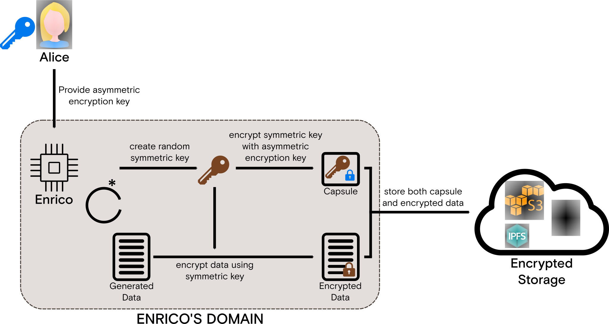

Character Concepts
==================

NuCypher's API is written as characters within a cryptological narrative / archetype each fulfilling a particular
role.

* **Alice**:  *"The Data Owner"* - retains full control over the data encrypted for her and determines whom to share the data with
* **Enrico**: *"The Encryptor"* - a data source that encrypts data for on behalf of Alice for some encryption key
* **Bob**:    *"The Data Recipient"* - the data recipient that Alice intends to share data with
* **Ursula**: *"The Proxy in PRE"* - the node on the NuCypher network that stands ready to re-encrypt data in exchange for payment in fees and token rewards; they enforce the access policy created by Alice

Character Functions
-------------------

Alice.Grant
^^^^^^^^^^^

.. image:: ../.static/img/alice_grant.svg
    :target: ../.static/img/alice_grant.svg

Alice may have data that she thinks she may want to share this data in the future. She uses NuCypher to create
an encryption key for Enrico to use when generating and storing data. Subsequently, Alice can delegate access to the
encrypted data to any recipient she sees fit. It is worth noting that the same encryption key can be used by Enrico
even though multiple policies can be created for multiple Bobs. Enrico, therefore, only has to encrypt data once using
a configurable asymmetric encryption key in order for data to be re-encrypted for all Bobs who have been granted access.

When Alice wants to share this information with Bob, she can create a
policy in the NuCypher network to grant access to him. In order to grant access to Bob, Alice must:

#. Create a re-encryption key based on the private key of encryption key and Bob's public key
#. Configure the conditions of the policy e.g. *expiration time, m-of-n threshold values*
#. Deploy the policy including associated fees to the blockchain
#. Deploy `n` policy arrangements, each containing a re-encryption key fragment, `kFrag`, to `n` nodes on the NuCypher Network

Enrico.Encrypt
^^^^^^^^^^^^^^

NuCypher uses the Umbral threshold proxy re-encryption scheme which employs a key encapsulation mechanism (KEM)/ data
encapsulation mechanism (DEM). In this approach, an ephemeral symmetric key is used to encrypt the data, and the
symmetric key is encrypted using an asymmetric encryption key. The encrypted data (the DEM portion) and the
encrypted symmetric key (the KEM portion called a `Capsule`) are stored collectively.

Even though different blocks of newly generated data may use different symmetric keys, the same asymmetric encryption
key provided by Alice is used to encrypt the symmetric key.

Bob.Retrieve
^^^^^^^^^^^^

.. image:: ../.static/img/bob_retrieve.svg
    :target: ../.static/img/bob_retrieve.svg

[Lorem ipsum...]

Ursula.Reencrypt
^^^^^^^^^^^^^^^^

.. image:: ../.static/img/ursula_reencrypt.svg
    :target: ../.static/img/ursula_reencrypt.svg

[Lorem ipsum...]

Alice.Revoke
^^^^^^^^^^^^

[Lorem ipsum...]