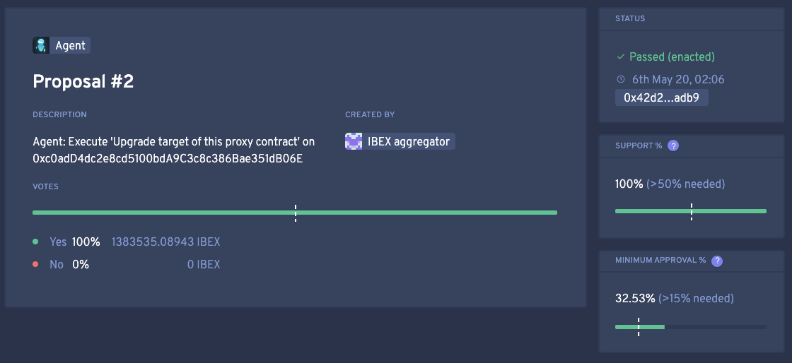

.. _dao-architecture:

NuCypher DAO
============

Overview
--------

The `NuCypher DAO <https://client.aragon.org/#/nucypherdao/>`_ is a decentralized autonomous organization to
rule over the NuCypher Network and powered by the `Aragon Project <https://aragon.org/>`_.

The NuCypher DAO comprises the core stakeholders: the stakers that put up resources to run nodes for the network and
serve users. NuCypher stakers will be able to validate issues, proposals, and changes that affect the daily operation
of the network, with validation power directly proportional to the amount of tokens staked. These issues include
proposed smart contract upgrades, changes to the global fee rates, and adjustments to other parameters of the NuCypher
protocol and the DAO itself. Additionally, all NuCypher stakers will be able to submit proposals to the DAO,
regardless of the size of their stake.

Validating Proposals
--------------------

Internally, the NuCypher DAO is powered by `Aragon OS <https://aragon.org/product>`_, which provides a secure
and well-engineered implementation for DAOs based on Ethereum, and an intuitive user interface to interact with
them. A central part of this DAO architecture is the Agent, a smart contract capable of executing proposals validated
by the community of stakers. The NuCypher Network's smart contracts are owned by the Agent which, in turn, is
configured in such a way that it only executes actions that are validated by a majority of the staking community.

For NuCypher stakers, the process of validating proposals is very straightforward. Each time a staker makes a
proposal to the community, all stakers have the chance to validate that proposal:

Clicking on ``Yes`` or ``No`` triggers an Ethereum transaction signalling each staker's opinion on the proposal.
Depending on whether a quorum is reached, proposals may be validated rejected. If they validated, they can take
immediate effect on the NuCypher Network via the Agent.

Note that not all proposals necessarily aim to produce on-chain effects on the network's smart contracts; some
proposals may seek to consolidate a current of thought among stakers. For example, deciding on new directions for
the network, or collecting the community's sentiment about some past event or decision.

DAO Forum
---------

The `DAO Forum <https://dao.nucypher.com/>`_ is the central arena (pun intended) to discuss, analyze, and collaborate
on potential solutions which may eventually be submitted as DAO proposals. Using the forum ensures rigorous analyses
and community consensus to provide the highest likelihood of acceptance of proposals to the NuCypher network. For
more information on the proposal process, consult the
`welcome message <https://dao.nucypher.com/t/welcome-to-the-dao-forum/29>`_.
