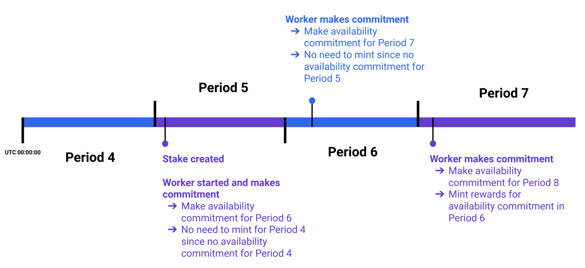

Periods
=======

In the NuCypher Network, a *Period* is the minimum unit of time for policy duration. This applies to sharing policy durations
and also corresponds to the frequency that Workers must make an on-chain commitment to being online and available.
Periods begin at UTC midnight.

Worker Period Commitment
------------------------
Once per period, Workers commit to being available to the Network for the next period via the ``commitToNextPeriod()``
operation in the ``StakingEscrow`` contract. This operation is performed automatically by a running Worker node and
consists of two parts:

#. Indicate availability for work in the next period.
#. Mint staking rewards for the previous period if availability was previously indicated.

In other words, committing to a period is prospective, and minting rewards is retrospective. To illustrate the process,
here is a simplified example:

* *Period 5*: A stake is created, and a Worker is initiated and started.
* *Period 5*: Worker calls ``commitToNextPeriod()`` to indicate availability for Period 6 (the next period) - the
  first period of availability. The Worker was unavailable during Period 4 (previous period), so there are no staking
  rewards to mint.
* *Period 6*: Worker calls ``commitToNextPeriod()`` to indicate availability for Period 7 (the next period). The Worker
  did not indicate availability for Period 5 (previous period) since it only started in Period 5, so there are no
  staking rewards to mint.
* *Period 6*: Worker successfully provides availability for work.
* *[Repeat]*

    * *Period 7*: Worker calls ``commitToNextPeriod()`` to indicate availability for Period 8. Since the Worker
      indicated its availability for the previous period (Period 6), staking rewards are minted for Period 6
    * *Period 7*: Worker successfully provides availability for work

.. note::

    The last two bullet points are repeated for subsequent periods moving forward.

Period Duration
---------------

Genesis
+++++++

At the Network launch on October 15th, 2020, the duration of a period was 24 hours. As a result, before UTC midnight,
Workers needed to make a per period (daily) on-chain commitment transactions indicating availability for the subsequent
period (after UTC midnight).

The cost of the commitment transaction is approximately 200k gas units but may be higher depending on the number of
sub-stakes a Staker has. Given the significant increase in Ethereum gas price since network launch, the cost of the daily
commitment transaction significantly increased and became untenable. Particularly for short stake durations and stake
sizes closer to the minimum stake size, the NU staking rewards and fees received from running a Worker may not cover
the cost of this commitment transaction.

Reducing the total amount of gas fees required to run a Worker became a necessity, and there have been multiple
mitigations:

#. Removal of inactive sub-stakes i.e. sub-stakes that expired and were no longer relevant (`PR #2384 <https://github.com/nucypher/nucypher/issues/2384>`_).
#. Addition of a Worker configuration setting to specify a cap on the gas price that Workers were willing to pay for the
   commitment transaction. Commitment attempts are made throughout the current period, and if the gas price at the time
   is too high, the commitment is not made (`PR #2445 <https://github.com/nucypher/nucypher/issues/2445>`_).

Ultimately these were incremental solutions, which worked around the underlying issue. A more comprehensive next step
was to increase the period duration i.e. reduce the frequency with which Workers needed to make the on-chain commitment
transaction, thereby reducing the cost by a factor based on the increase in period duration.

Taking a long-term perspective, lowering Worker overhead encourages more participation, and enables more
competitive break-even policy fee price points for network usage which is likely to increase user adoption.

7-Day Period
++++++++++++

A `proposal to increase the protocol period duration <https://dao.nucypher.com/t/1-improve-staker-p-l-by-increasing-period-duration/110>`_,
outlining the pros and cons, was put forth to the :doc:`NuCypher DAO </architecture/dao>`, and a 7-day period duration
received the majority of votes. On Wednesday, April 14th, 2021, the NuCypher DAO approved the period migration, and subsequently,
the period duration for the NuCypher protocol.

Modifying the period duration to 7 days involved changes to the ``StakingEscrow`` and ``PolicyManager`` smart
contracts, and the economics parameters for the protocol that include period duration, inflation parameters,
minimum staking periods, policy fee per period etc. all of which needed to be adjusted due to the
new minimum unit of time.

The period duration modification reduces the frequency of on-chain
commitment transactions (and therefore worker gas costs) and has minimal impact on the total staking rewards
received for running a Worker.  However, since the commitment transaction occurs every 7 days, staking rewards
will also be minted once every 7 days (instead of daily), but the reward rate remains the same
(the minted value will be 7 days worth).

Since period numbers are calculated relative to Unix epoch time, a period duration of 7 days will cause periods
to always start on Thursdays at UTC midnight *(Fun fact: the Unix epoch - January 1st, 1970 - was on a
Thursday so period calculations will always yield Thursday as the start of a new period).*

.. important::

    The NuCypher DAO may decide to update the period duration again in the future.
