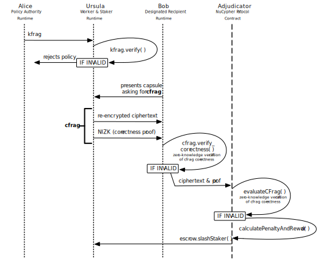

.. _slashing-protocol:

The Slashing Protocol
=====================

The slashing protocol is a preventative mechanism that disincentivizes certain staker actions, whether deliberate or unintentional, that may negatively impact service quality or network health. If prohibited actions (‘violations’) are attributably detected at any moment, the protocol responds by irreversibly forfeiting (‘slashing’) a portion of the offending staker’s collateral (‘stake’).

At network genesis, the protocol will be able to detect and attribute instances of incorrect re-encryptions returned by Ursulas. The staker controlling the incorrectly re-encrypting Ursula will have their stake reduced by a nominal sum of NU tokens.

Violations
----------

In response to an access request by Bob, Ursula must generate a re-encrypted ciphertext that perfectly corresponds to the associated sharing policy (i.e. precisely what Alice intended Bob to receive). If the ciphertext is invalid in this regard, then Ursula is deemed to be incorrectly re-encrypting. Each instance of incorrect re-encryption is an official violation and is individually punished.

There are other ways stakers can compromise service quality and network health, such as extended periods of downtime or ignoring access requests. Unlike incorrect re-encryptions, these actions are not yet reliably attributable. Punishing non-attributable actions may result in unacceptable outcomes or introduce perverse incentives, thus these actions are not yet defined as violations by the slashing protocol. 


Detection
----------

Incorrect re-encryptions are detectable by Bob, who can then send a proof to the protocol to confirm the violation. This is enabled by a bespoke zero-knowledge correctness verification mechanism, which follows these steps:

1. When Alice creates a kFrag, it includes components to help Ursula prove the correctness of each re-encryption she performs. The kFrag’s secret component is used to perform the re-encryption operation. The kFrag also comprises public components, including a point commitment on the value of the secret component.
2. When Ursula receives the kFrag, she checks its validity – that the point commitment on the secret component is correct. This ensures that she doesn’t incorrectly re-encrypt due to Alice’s error (or attack).
3. Bob makes a re-encryption request by presenting a capsule to Ursula, and she responds with a cFrag. This contains the payload (a re-encrypted ciphertext) and a non-interactive zero knowledge proofs of knowledge (NIZK).
4. Bob checks the validity of the cFrag using the NIZK. He verifies that the point commitment corresponds to the ciphertext. He also checks that the cFrag was generated using his capsule, by verifying that it was created with the correct public key.
5. If any of the verifications fail, then Bob supplies the ciphertext and NIZK to the :ref:`Adjudicator contract <contracts>`. The contract examines Bob's claim by checking whether the NIZK proof for the ciphertext fails, leveraging `optimized ECC algorithms <https://github.com/nucypher/numerology>`_.
6. If the invalidity of the cFrag is confirmed by the Adjudicator contract, the delivery of a faulty cFrag to Bob is ruled to be an official protocol violation. A penalty is computed and the owner of the offending Ursula has their stake immediately slashed by the penalty amount.

Penalties
---------

TBD
