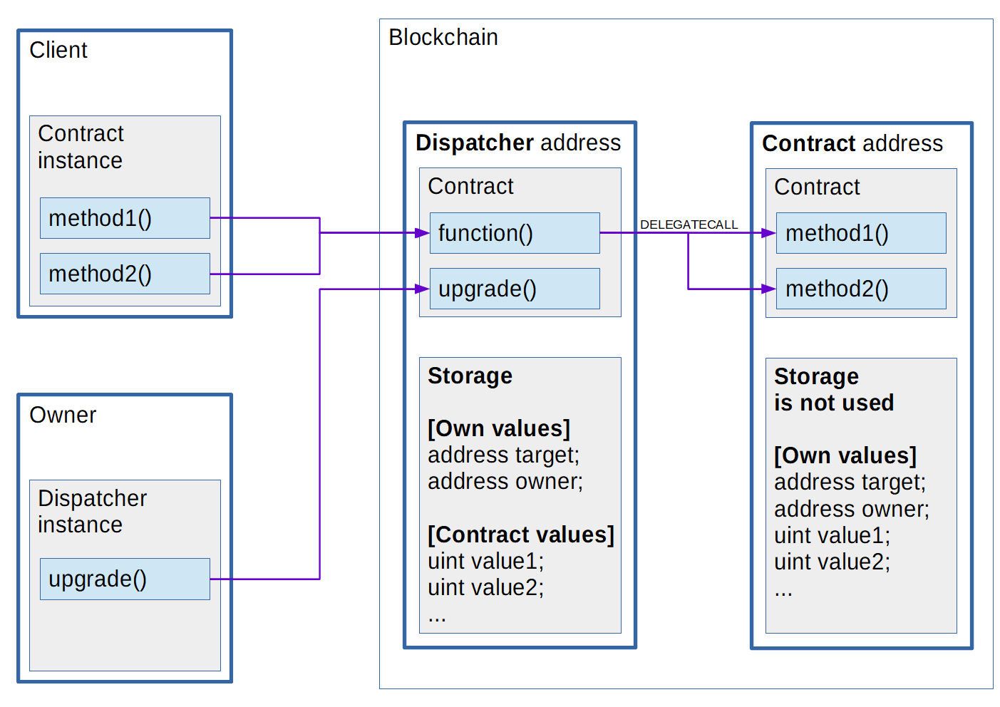

Approaches to Upgradeable Contracts
===================================

Smart contracts in Ethereum are immutable...
In order to fix bugs and provide upgrade logic it is possible to change the contract (address) and save the original contract's storage values.

Approach A
----------

One simple way to achieve this is to create a new contract, copy the original storage values to the new contract, then self-destruct (mark as deleted) the old contract.
When this happens, the client changes the address used for a requested contract.

.. note::

  There will be two deployed versions of the contract during storage migration

Approach B
----------

A more convenient way is to use a proxy contract with an interface where each method redirects to the *target* contract.
This option is advantageous because the client uses one address most of the time but also has its own methods.

.. important::

   If updates to the proxy contract's methods are made, then the client will need to change proxy address also.

Approach C
----------

Another way is using a fallback function in the proxy contract - this function will execute on any request, redirecting the request to the target and returning the resulting value (using opcodes).
This is similar to the previous option, but this proxy doesn't have interface methods, only a fallback function, so there is no need to change the proxy address if contract methods are changed.

This approach is not ideal, and has some restrictions:

* Sending Ether from a client's account to the contract uses the fallback function and such transactions can only consume 2300 gas (http://solidity.readthedocs.io/en/develop/contracts.html#fallback-function).
* Proxy contracts (Dispatcher) hold storage (not in the contract itself). While upgrading storage, values must be the same or equivalent (see below).

Interaction scheme
------------------

``Dispatcher`` - a proxy contract that redirects requests to the target address.
It also holds its own values (owner and target address) and stores the values of the target contract, but not explicitly.
The client should use the resulting contract or interface ABI while sending request to the ``Dispatcher`` address.
The contract's owner can change the target address by using the ``Dispatcher``'s ABI.
The ``Dispatcher`` contract uses ``delegatecall`` for redirecting requests, so ``msg.sender`` remains as the client address
and uses the dispatcher's storage when executing methods in the target contract.

.. warning::

   If target address is not set, or the target contract does not exist, results may be unpredictable because ``delegatecall`` will return ``true``.

``Contract`` - upgradeable contract, each version must have the same ordering of storage values.
New versions of the contract can expand values, but must contain all the old values (containing values from dispatcher **first**).
This contract is like a library because its storage is not used.
If a client sends a request to the contract directly to its deployed address without using the dispatcher,
then the request may execute (without exception) using the wrong target address.

Development
-----------

* Use ``Upgradeable`` as base contract for all contracts that will be used with ``Dispatcher``.
* Implement ``verifyState(address)`` method which checks that a new version has correct storage values.
* Implement ``finishUpgrade(address)`` method which copies initialization data from library storage to the dispatcher's storage.
* Each upgrade should include tests which check storage equivalence.

Sources
-------

More examples:

* https://github.com/maraoz/solidity-proxy - Realization of using libraries (not contracts) but too complex and some ideas are obsolete after Byzantium hard fork.
* https://github.com/willjgriff/solidity-playground - Most of the upgradeable proxy contract code is taken from this repository.
* https://github.com/0v1se/contracts-upgradeable - Source code for verifying upgrade.
