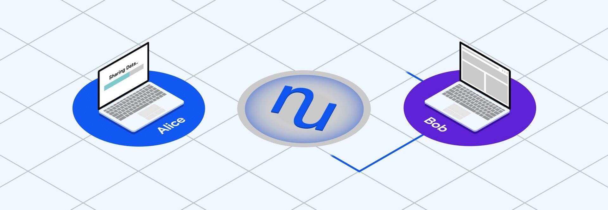

.. warning::

   NuCypher is currently in the *Alpha* development stage and is **not** intended for use in production.

NuCypher: Decentralized Access Control
======================================

NuCypher enables censorship-resistant, end-to-end encrypted data sharing via *threshold proxy re-encryption* and a distributed network of service-providers.

----

.. image:: https://img.shields.io/pypi/wheel/nucypher.svg
    :target: https://pypi.org/project/nucypher/

.. image:: https://img.shields.io/pypi/pyversions/nucypher.svg
    :target: https://pypi.org/project/nucypher/

.. image:: https://coveralls.io/repos/github/nucypher/nucypher/badge.svg?branch=master
    :target: https://coveralls.io/github/nucypher/nucypher?branch=master

.. image:: https://img.shields.io/discord/411401661714792449.svg
    :target: https://discord.gg/M5B7Nh

.. image:: https://readthedocs.org/projects/nucypher/badge/?version=latest
    :target: https://nucypher.readthedocs.io/en/latest/?badge=latest
    :alt: Documentation Status

.. image:: https://img.shields.io/pypi/l/nucypher.svg
    :target: https://www.gnu.org/licenses/gpl-3.0.html

- GitHub https://www.github.com/nucypher/nucypher
- Documentation https://nucypher.readthedocs.io/en/latest/
- Website https://www.nucypher.com/

A short and efficient love story 
--------------------------------

Alice composes and sends a romantic poem to her lover, Bob. Sadly, she then drops her device into a pond. A few hours later, Bob turns on his mobile. How will he receive the poem? 

.. code::

    $ delivered_cleartexts = BOB.retrieve(message_kit=single_passage_ciphertext,
                                          data_source=enrico_as_understood_by_bob, 
                                          alice_verifying_key=alice_pubkey_restored_from_ancient_scroll)

Bob's .retrieve() power sets off a series of exciting events, leading to the involvement of Ursula, an untrusted but diligent *proxy*. Ursula takes the ciphertext associated with Alice's message, then uses a special *re-encryption key* to transform it into a form decryptable by Bob. 

.. code::

    $ cfrag = pre.reencrypt(kfrag, 
                            capsule, 
                            metadata=capsule_signed_by_both)

Bob hunts transformed ciphertexts from other participating Ursulas, re-combines them and finally, uses his private key to decrypt the underlying message. The poem is disappointing, and Bob is grateful that no third-party entity was trusted with the plaintext version. 

Whitepapers
-----------

**Network**

    https://github.com/nucypher/whitepaper/blob/master/whitepaper.pdf

    *"NuCypher - A proxy re-encryption network to empower privacy in decentralized systems"*
    *by Michael Egorov, David Nuñez, and MacLane Wilkison - NuCypher*

**Economics**

    https://github.com/nucypher/mining-paper/blob/master/mining-paper.pdf

    *"NuCypher - Mining & Staking Economics"*
    *by Michael Egorov, MacLane Wilkison - NuCypher*

**Cryptography**

    https://github.com/nucypher/umbral-doc/blob/master/umbral-doc.pdf

    *"Umbral A Threshold Proxy Re-Encryption Scheme"*
    *by David Nuñez - NuCypher*

.. toctree::
   :maxdepth: 2

Guides
------

.. toctree::
   :maxdepth: 2

   guides/quickstart
   guides/federated_testnet_guide
   guides/installation_guide
   guides/ursula_configuration_guide
   guides/contribution_guide

Demos
-----

.. toctree::
   :maxdepth: 2

   demos/local_fleet_demo
   demos/finnegans_wake_demo
   demos/heartbeat_demo

Architecture
------------

.. toctree::
   :maxdepth: 1

   architecture/contracts
   architecture/upgradeable_proxy_contracts

API
---

.. toctree::
   :maxdepth: 2

   api/characters
   api/config
   api/crypto
   api/keyring
   api/keystore
   api/network
   api/policy

Release Notes
-------------

.. toctree::
   :maxdepth: 1

   release_notes/genesis_release

Indices and Tables
==================
* :ref:`genindex`
* :ref:`modindex`
* :ref:`search`
