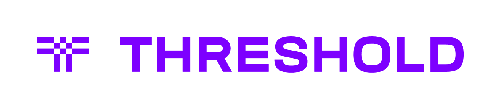

.. _Umbral: https://github.com/nucypher/pyUmbral

`Welcome <https://blog.threshold.network/threshold-launch/>`_ to the Threshold Network!

Introduction
=============

The `NuCypher Network <https://www.nucypher.com/>`_ has merged with the
`KEEP Network <https://keep.network/>`_ to form the `Threshold Network <https://threshold.network/>`_!

The Threshold Network powers user sovereignty on the public blockchain. It provides a decentralized
network of nodes that perform threshold cryptography operations as a service to ensure full control over
your digital assets.

.. raw:: html

    

        

            <iframe style="position:absolute;top:0;left:0;width:100%;height:100%;" src="https://www.youtube-nocookie.com/embed/8MzE_FG67Z8?rel=0&controls=1&modestbranding=1" frameborder="0"
            allow="accelerometer; autoplay; clipboard-write; encrypted-media; gyroscope; picture-in-picture" allowfullscreen></iframe>
        

   

    

Proxy Re-Encryption (PRE) Application
=====================================

The NuCypher Network proxy re-encryption (PRE) service is now the PRE Application on the Threshold Network.

The PRE Application is the first of many *threshold cryptography*-based applications
to be hosted on the Threshold Network. PRE is an end-to-end encryption protocol that is a more scalable, more flexible form of
`public-key encryption <https://en.wikipedia.org/wiki/Public-key_cryptography>`_ and enables a group of proxy
entities to transform encrypted data from one public key to another, without the power to decrypt the data or gain access to any
private keys. PRE equips developers, applications and end-users with **secrets management** and **dynamic access control** capabilities.
This service is provided by a decentralized array of nodes on the Threshold Network, each running the same PRE client software.

Private data, wherever stored, remains private, confidential
and encrypted while maintaining the ability to share that data with trusted parties.

.. attention::

    In order to run a PRE node on Threshold, ``nucypher`` v6.0.0 or above will be required.
    See `releases <https://pypi.org/project/nucypher/#history>`_ for the latest version.

How does it Work?
-----------------

.. image:: ./.static/img/nucypher_overview.svg
    :target: ./.static/img/nucypher_overview.svg

1. Alice, the data owner, grants access to her encrypted data to
anyone she wants by creating a policy and uploading it to
the PRE Application on the Threshold Network.

2. Alice gets information about the group of ``n`` PRE nodes (Ursulas) associated
with the policy, which are nodes on the Threshold network providing the PRE service. Each :term:`Ursula` provides their encrypting key, and Alice creates
``n`` re-encryption key shares (:term:`kFrag`), each of which is encrypted with a different Ursula's encrypting key.
The Ursulas in the group stand ready to re-encrypt data in exchange for payment in fees and token rewards.
The list of Ursulas and their associated encrypted re-encryption key shares are stored in a :term:`Treasure Map`. Alice
subsequently encrypts the treasure map for Bob. The treasure map provides Bob the requisite information and cryptographic material to successfully request the Threshold network to re-encrypt the data shared by Alice – such that he can decrypt it with his private key.

3. Each policy created by Alice has an associated encryption key, which can be used
by any entity (Enrico) to encrypt data on Alice's behalf.
This entity could be an IoT device in her car, a collaborator assigned
the task of writing data to her policy, or even a third-party creating
data that belongs to her – for example, a lab analyzing medical tests.
The resulting encrypted data can be uploaded to IPFS, Swarm, S3,
or any other storage layer.

4. Bob, a data recipient, uses the treasure map to determine the list of Ursulas to contact and the associated
re-encryption key share to send to Ursula for the re-encryption operation. Bob obtains the encrypted data from the
storage layer and sends a re-encryption request to the relevant Ursulas on the Threshold network. If the policy is
satisfied, Ursula decrypts the provided re-encryption key share and re-encrypts the data to Bob's public key. Bob
can subsequently decrypt the data with his private key.

5. Ursulas earn fees and token rewards for being available to perform re-encryption operations.

More detailed information:

- :ref:`character-concepts`
- GitHub https://www.github.com/nucypher/nucypher
- Website https://www.nucypher.com/

Whitepapers
-----------

**Original Network**

    https://github.com/nucypher/whitepaper/blob/master/whitepaper.pdf

    *"NuCypher - A proxy re-encryption network to empower privacy in decentralized systems"*
    *by Michael Egorov, David Nuñez, and MacLane Wilkison - NuCypher*

**Cryptography**

    https://github.com/nucypher/umbral-doc/blob/master/umbral-doc.pdf

    *"Umbral A Threshold Proxy Re-Encryption Scheme"*
    *by David Nuñez - NuCypher*

.. toctree::
   :maxdepth: 1
   :caption: Threshold

   threshold/threshold_overview

.. toctree::
   :maxdepth: 1
   :caption: PRE Application

   pre_application/overview
   pre_application/node_requirements
   pre_application/running_a_node
   pre_application/cloud_node_management
   pre_application/best_practices
   pre_application/node_providers

.. toctree::
   :maxdepth: 1
   :caption: Application Development

   application_development/getting_started
   application_development/web_development

.. toctree::
   :maxdepth: 1
   :caption: References

   references/installation
   references/cli_reference
   references/environment_variables
   references/network_events

.. toctree::
   :maxdepth: 1
   :caption: Architecture

   architecture/character
   architecture/contracts
   architecture/upgradeable_proxy_contracts
   architecture/slashing
.. TODO perhaps categorize architecture section

.. toctree::
   :maxdepth: 1
   :caption: APIS

   api/modules

.. toctree::
   :maxdepth: 1
   :caption: Support

   release_notes/releases
   support/contribution
   support/community
   support/troubleshooting
   support/faq
   glossary

Indices and Tables
==================
* :ref:`genindex`
* :ref:`modindex`
* :ref:`search`
