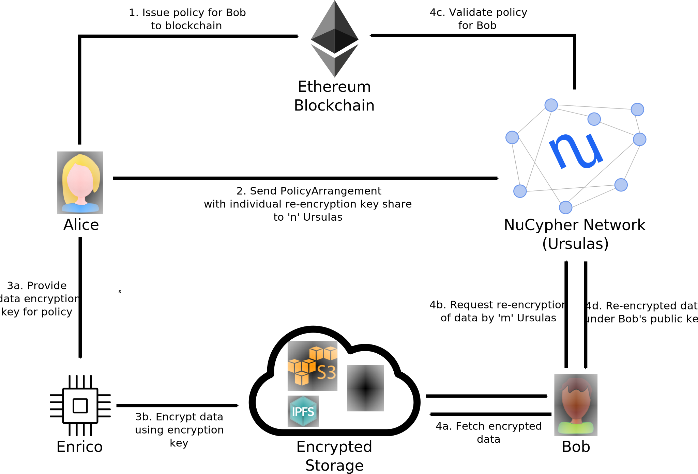

Introduction
=============

.. _Umbral: https://github.com/nucypher/pyUmbral

The NuCypher network is a decentralized network of nodes that perform threshold
cryptography operations serving users with secrets management and dynamic access control.
``nucypher`` is the python library and CLI for interacting with the
decentralized threshold cryptography network.

How does NuCypher work?
-----------------------

1. Alice, the data owner, grants access to her encrypted data to
anyone she wants by creating a policy and uploading it to
the NuCypher network.

2. A group of Ursulas, which are nodes on the NuCypher network,
receive information about the policy, called a ``PolicyArrangement`` that include
a re-encryption key share. The Ursulas stand ready to re-encrypt data in exchange for payment
in fees and token rewards. Thanks to the use of proxy re-encryption,
Ursulas and the storage layer never have access to Alice's plaintext data.

3. Each policy created by Alice has an associated encryption key, which can be used
by any entity (Enrico) to encrypt data on Alice's behalf.
This entity could be an IoT device in her car, a collaborator assigned
the task of writing data to her policy, or even a third-party creating
data that belongs to her – for example, a lab analyzing medical tests.
The resulting encrypted data can be uploaded to IPFS, Swarm, S3,
or any other storage layer.

4. Bob, a data recipient, obtains the encrypted data from the storage layer and sends an access request
to the NuCypher network. If the policy is satisfied, the data is re-encrypted to his public key
and he can decrypt it with his private key.

5. Ursulas earn fees and token rewards for performing
re-encryption operations.

More detailed information:

- GitHub https://www.github.com/nucypher/nucypher
- Website https://www.nucypher.com/

Whitepapers
-----------

**Network**

    https://github.com/nucypher/whitepaper/blob/master/whitepaper.pdf

    *"NuCypher - A proxy re-encryption network to empower privacy in decentralized systems"*
    *by Michael Egorov, David Nuñez, and MacLane Wilkison - NuCypher*

**Economics**

    https://github.com/nucypher/whitepaper/blob/master/economics/staking_protocol/NuCypher_Staking_Protocol_Economics.pdf

    *"NuCypher Network: Staking Protocol & Economics"*
    *by Michael Egorov, MacLane Wilkison, Arjun Hassard - NuCypher*

    https://github.com/nucypher/whitepaper/blob/master/economics/pricing_protocol/NuCypher_Network__Pricing_Protocol_Economics.pdf

    *"NuCypher Network: Pricing Protocol & Economics"*
    *by Arjun Hassard - NuCypher*

**Cryptography**

    https://github.com/nucypher/umbral-doc/blob/master/umbral-doc.pdf

    *"Umbral A Threshold Proxy Re-Encryption Scheme"*
    *by David Nuñez - NuCypher*

.. toctree::
   :maxdepth: 1
   :caption: Staking

   staking/overview
   staking/stake_initialization
   staking/stake_management
   staking/running_a_worker
   staking/best_practices
   staking/worklock
   staking/testnet
   staking/remote_worker_cli

.. toctree::
   :maxdepth: 1
   :caption: Application Development

   application_development/getting_started
   application_development/http_character_control
   application_development/cli_examples
   application_development/local_fleet_demo
   application_development/testnet

.. toctree::
   :maxdepth: 2
   :caption: References

   references/pip-installation
   references/cli_reference
   references/network_events
   references/signers
   references/environment_variables
   references/networks

.. toctree::
   :maxdepth: 1
   :caption: Demos

   demos/finnegans_wake_demo
   demos/heartbeat_demo

.. toctree::
   :maxdepth: 1
   :caption: Architecture

   architecture/character
   architecture/worklock
   architecture/contracts
   architecture/upgradeable_proxy_contracts
   architecture/dao
   architecture/rewards_and_service_fees
   architecture/sub_stakes
   architecture/slashing
   architecture/period_duration
   architecture/staking_contracts
.. TODO perhaps categorize architecture section

.. toctree::
   :maxdepth: 1
   :caption: APIS

   api/modules
   contracts_api/index

.. toctree::
   :maxdepth: 1
   :caption: Release Notes

   release_notes/genesis_release
   release_notes/pre_release_epics
   release_notes/releases.rst

.. toctree::
   :maxdepth: 1
   :caption: Support

   support/contribution
   support/node_providers
   support/community
   support/troubleshooting
   support/faq
   glossary

Indices and Tables
==================
* :ref:`genindex`
* :ref:`modindex`
* :ref:`search`
