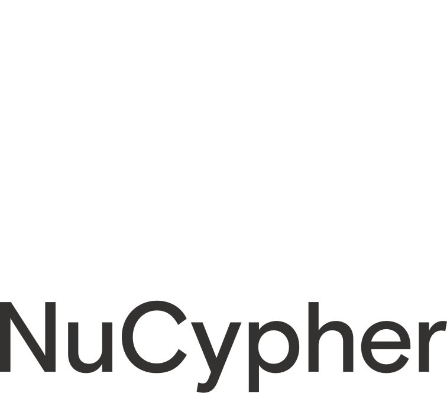

NuCypher
========
*A proxy re-encryption network to empower privacy in decentralized systems*

----

.. image:: https://circleci.com/gh/nucypher/nucypher/tree/master.svg?style=svg
    :target: https://circleci.com/gh/nucypher/nucypher/tree/master

.. image:: https://img.shields.io/pypi/wheel/nucypher.svg
    :target: https://pypi.org/project/nucypher/

.. image:: https://img.shields.io/pypi/pyversions/nucypher.svg
    :target: https://pypi.org/project/nucypher/

.. image:: https://coveralls.io/repos/github/nucypher/nucypher/badge.svg?branch=master
    :target: https://coveralls.io/github/nucypher/nucypher?branch=master

.. image:: https://img.shields.io/discord/411401661714792449.svg
    :target: https://discord.gg/M5B7Nh

.. image:: https://img.shields.io/pypi/l/nucypher.svg
    :target: https://www.gnu.org/licenses/gpl-3.0.html

- GitHub https://www.github.com/nucypher/nucypher
- Documentation https://nucypher.readthedocs.io/en/latest/
- Website https://www.nucypher.com/

Whitepapers
-----------

**Network**

    https://github.com/nucypher/whitepaper/blob/master/whitepaper.pdf

    *"NuCypher - A proxy re-encryption network to empower privacy in decentralized systems"*
    *by Michael Egorov, David Nuñez, and MacLane Wilkison - NuCypher*

**Economics**

    https://github.com/nucypher/mining-paper/blob/master/mining-paper.pdf

    *"NuCypher - Mining & Staking Economics"*
    *by Michael Egorov, MacLane Wilkison - NuCypher*

**Cryptography**

    https://github.com/nucypher/umbral-doc/blob/master/umbral-doc.pdf

    *"Umbral A Threshold Proxy Re-Encryption Scheme"*
    *by David Nuñez - NuCypher*

.. warning::

   NuCypher is currently in the *Alpha* development stage and is **not** intended for use in production.

.. toctree::
   :maxdepth: 2

Guides
------

.. toctree::
   :maxdepth: 2

   guides/quickstart
   guides/federated_testnet_guide
   guides/installation_guide
   guides/ursula_configuration_guide
   guides/contribution_guide

Demos
-----

.. toctree::
   :maxdepth: 2

   demos/local_fleet_demo
   demos/finnegans_wake_demo
   demos/heartbeat_demo

Architecture
------------

.. toctree::
   :maxdepth: 1

   architecture/contracts
   architecture/upgradeable_proxy_contracts

API
---

.. toctree::
   :maxdepth: 2

   api/characters
   api/config
   api/crypto
   api/keyring
   api/keystore
   api/network
   api/policy

Release Notes
-------------

.. toctree::
   :maxdepth: 1

   release_notes/genesis_release

Indices and Tables
==================
* :ref:`genindex`
* :ref:`modindex`
* :ref:`search`
