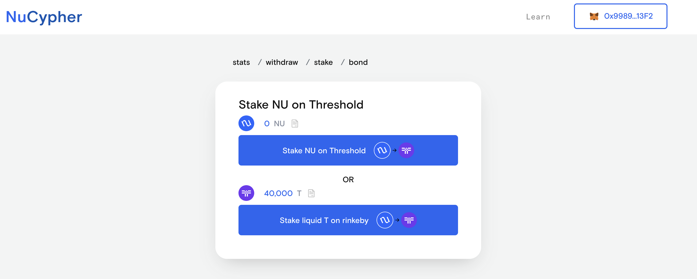
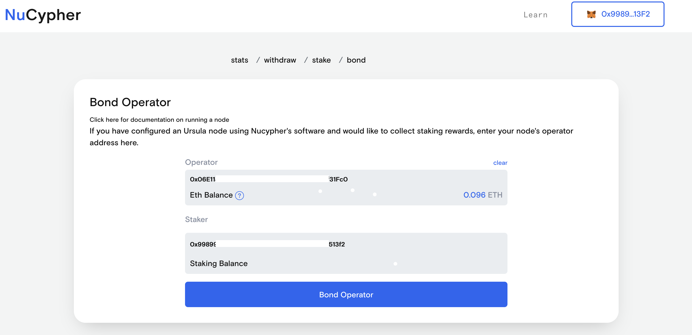

.. _cloud-provider-tutorial:

=============================================================================
Tutorial for Creating a Threshold PRE Testnet Node on a Remote Cloud Provider
=============================================================================

In this tutorial we're going to setup a Threshold PRE Node on the rinkeby testnet using a remote cloud provider (Digital Ocean, AWS, etc).
Whilst this example will demonstrate how to deploy to Digital Ocean, the steps for any other infrastructure provider are virtually identical.
There are a few pre-requisites before we can get started.
First, we need to create accounts at `Digital Ocean <https://cloud.digitalocean.com/>`_ and `Infura <https://infura.io>`_.
We also need at least 40,000T in our wallet.
There are currently no Threshold faucets but if you ask in the `Discord <https://discord.gg/Threshold>`_ channel, someone will be happy to help you out.

   .. note::

      Ensure that you are using a wallet on the rinkeby testnet, don't use a mainnet address.

Digital Ocean
-------------
All of our Digital Ocean configuration will be done automatically, but there are two local environment variables we need to set in order to make this work:
- ``DIGITALOCEAN_ACCESS_TOKEN`` - Your Digital Ocean `access token <https://docs.digitalocean.com/reference/api/create-personal-access-token/>`_`
- ``DIGITAL_OCEAN_KEY_FINGERPRINT`` - Your Digital Ocean `key fingerprint <https://docs.digitalocean.com/products/droplets/how-to/add-ssh-keys/to-account/>`_.

Follow those two blog posts and either ``export`` the variables or add them to your ``~/.bashrc`` file.

Infura
------
We need a way to interact with both the Ethereum and Polygon testnet networks; Infura makes this easy for us.
Create a new project at Infura with product type ``ETHEREUM``.
Also, add the Polygon add-on to this project.
We're going to create two more environment variables:

- ``INFURA_RINKEBY_URL``
- ``INFURA_MUMBAI_URL``
  
In the **Project Settings**, change the ``ENDPOINTS`` to ``RINKEBY`` / ``POLYGON_MUMBAI``.
Set the above environment variables to the corresponding ``https`` endpoint.

Overall the environment variable process should look something like:

.. code-block:: bash

    $ export INFURA_RINKEBY_URL=https://rinkeby.infura.io/v3/bd76baxxxxxxxxxxxxxxxxxxxxxf0ff0
    $ export INFURA_MUMBAI_URL=https://polygon-mumbai.infura.io/v3/bd76baxxxxxxxxxxxxxxxxxxxxxf0ff0
    $ export DIGITALOCEAN_ACCESS_TOKEN=4ade7a8701xxxxxxxxxxxxxxxxxxxxxxxxxxxxxxxxxxxxxxxxxxxxxxxxbafd23
    $ export DIGITAL_OCEAN_KEY_FINGERPRINT=28:38:e7xxxxxxxxxxxxxxxxxxxxxxxxxxxxxxxxx:ca:5c

Setup Remote Node
-----------------
Locally, we will install `NuCypher Ops <https://github.com/nucypher/nucypher-ops>`_ to handle the heavy lifting of setting up a node.

.. code-block:: bash

    $ pip install nucypher-ops

Now NuCypher Ops is installed we can create a droplet on Digital Ocean:

.. code-block:: bash

    nucypher-ops nodes create --network ibex --count 1 --cloudprovider digitalocean

At this point you should see the droplet in your Digital Ocean dashboard.
Now we can deploy the PRE Node:

.. code-block:: bash

    nucypher-ops ursula deploy --eth-provider $INFURA_RINKEBY_URL --nucypher-image nucypher/nucypher:experimental --payment-provider $INFURA_MUMBAI_URL --network ibex

This should produce a large amount of logs as the ansible plays install all the requirements and setup the node.
The final output should be similar to:

.. code-block:: bash

    some relevant info:
    config file: "/SOME_PATH/nucypher-ops/configs/ibex/nucypher/ibex-nucypher.json"
    inventory file: /SOME_PATH/nucypher-ops/configs/ibex-nucypher-2022-03-25.ansible_inventory.yml
    If you like, you can run the same playbook directly in ansible with the following:
        ansible-playbook -i "/SOME_PATH/nucypher-ops/configs/ibex-nucypher-2022-03-25.ansible_inventory.yml" "src/playbooks/setup_remote_workers.yml"
    You may wish to ssh into your running hosts:
        ssh root@123.456.789.xxx
    *** Local backups containing sensitive data may have been created. ***
    Backup data can be found here: /SOME_PATH//nucypher-ops/configs/ibex/nucypher/remote_worker_backups/

This tells us the location of several config files and helpfully prints the ip of our newly created node (you can also see this on the Digital Ocean dashboard).
Let's `ssh` into it and look at the logs:

.. code-block:: bash

    $ ssh root@123.456.789.xxx
    root@nucypher-ibex-1:~#
    root@nucypher-ibex-1:~# sudo docker logs --follow ursula
    ...
    ! Operator 0x06E11400xxxxxxxxxxxxxxxxxxxxxxxxxxxx1Fc0 is not funded with ETH
    ! Operator 0x06E11400xxxxxxxxxxxxxxxxxxxxxxxxxxxx1Fc0 is not bonded to a staking provider
    ...

These lines will print repeatedly until the Operator is funded with some ETH and bonded to a staking provider.
Send ETH to the operator address that is printed

Stake and Bond
--------------
Now that our operator is funded with ETH, we're ready to stake and bond.
At this point you need some testnet ETH and 40,000 T in a metamask wallet.
Again, ask in the discord if you need help with this.

Navigate to the `Testnet Staking Dashboard <https://dn3gsazzaajb.cloudfront.net/manage/stake>`_ and connect your metamask wallet.
Go to the **stake** tab and click "Stake liquid T on rinkeby"

Allow the 40,000 T spend, and then stake it.
Both transactions will require authorization via metamask.
You can ignore the **Configure Addresses** option - they should all default to the currently connected account.

Once those transactions are confirmed, swith to the **bond** tab.
Here you will paste the Operator address that is being printed by the docker logs:

Once that transaction is confirmed, switch back to view the logs of the node.
You should see:

.. code-block:: bash

    Broadcasting CONFIRMOPERATORADDRESS Transaction (0.00416485444 ETH @ 88.58 gwei)
    TXHASH 0x3329exxxxxxxxxxxxxxxxxxxxxxxxxxxxxxxxxxxxxxxxxxxxxxxxxxxxx5ec9a6
    ✓ Work Tracking
    ✓ Start Operator Bonded Tracker
    ✓ Rest Server https://123.456.789.000:9151
    Working ~ Keep Ursula Online!

You can view the status of your node by visiting `https://YOUR_NODE_IP:9151/status`
