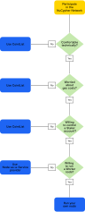

.. _running-a-node:

Stakers and Workers
===================

Nucypher staking operations are divided into two roles - “Staker” and “Worker”.
The Staker can be thought of as a fiduciary administrator that holds NU and collects rewards.
The Worker is bonded to a Staker and performs work on behalf of the Staker.

Staker Overview
----------------

A nucypher staker is a holder of NU and manager of one or more stakes.  Stakes are initiated by locking NU into
the *"Staking Escrow "* contract for a fixed duration of time.  Staked NU earns two income streams: inflation
rewards (NU) and policy fees (ETH). Staked NU gradually unlocks with each period of completed,
depending on *re-stake* and *wind-down* options (more on this later).

Active network participation (work) is delegated to a *Worker* node through *bonding*. There is a 1:1 relationship
between the roles; One staker to one worker. A Staker controls a single ethereum account and may have multiple stakes,
but only ever has one Worker bonded at a time. Once the stake is bonded to a worker node, it can only
be *rebonded* once every 2 periods (48 Hours).

Worker Overview
----------------

*Worker* - (aka "Ursula") Active network participant who carries out re-encryption work orders.

The Worker is the bonded delegate of a Staker and an active network node. Workers must remain online to provide
uninterrupted re-encryption services on-demand. Each staking account or Staker is bonded to exactly one Worker.
The worker's ethereum account must remain unlocked to send automated work confirmation transactions and have enough
ether to pay for transaction gas; however, it is *not* necessary (and potentially risky) to hold NU tokens on a worker's
account for any reason.

Staker and Worker Delegation
-----------------------------

There are several strategies for running and maintaining a staking node:

* Delegate custody of NU and work to a third-party custodian.
* Delegate work via a staking pool or `Node-as-a-Service provider <https://github.com/nucypher/validator-profiles>`_.
* Run your own node

Here is a simple heuristic to help decide on a course of action:

