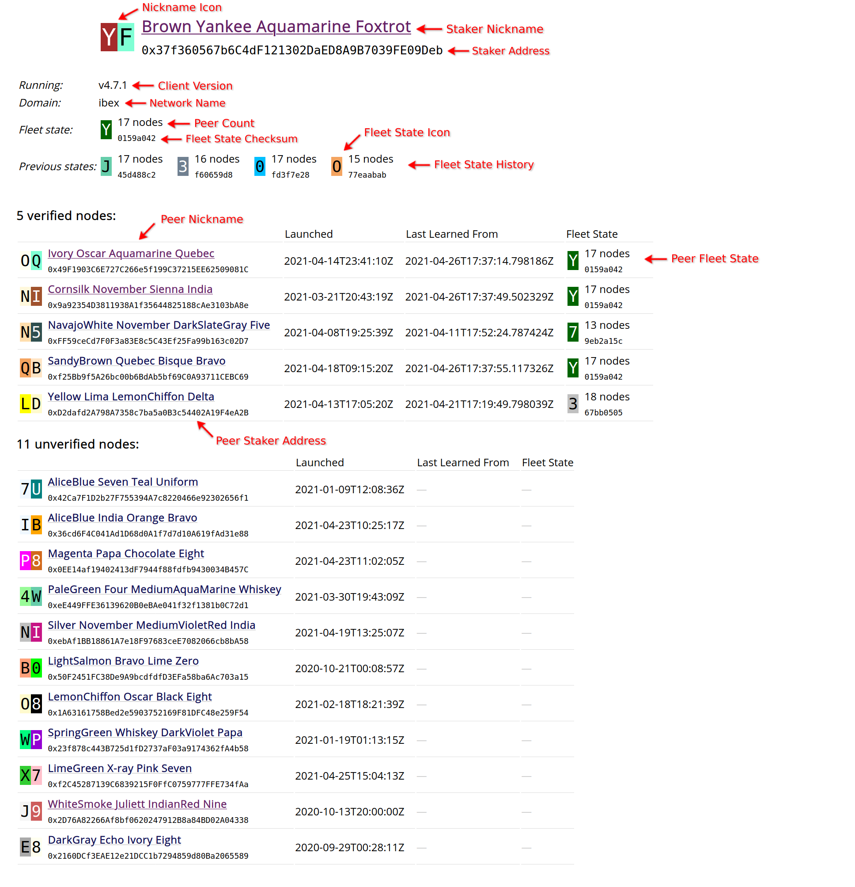
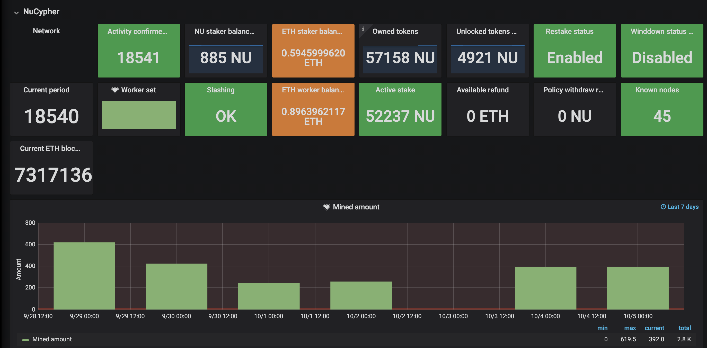

.. _ursula-config-guide:

================
Running a Worker
================

NuCypher staking operations are divided into two roles "Staker" and "Worker" - This Guide is for Workers.

Overview
----------

Role in the Network
^^^^^^^^^^^^^^^^^^^

The Worker is the bonded delegate of a Staker and an active network node.  Each staking account
or "Staker" is bonded to exactly one Worker. Workers must remain online to provide uninterrupted
re-encryption services to network users on-demand and perform periodic automated transactions to
signal continued commitment to availability.

Core Components
^^^^^^^^^^^^^^^

Worker nodes have three core components:

* Ethereum software wallet (keystore)
* Local or hosted ethereum provider
* Worker node; Local or cloud server

Minimum System Requirements
^^^^^^^^^^^^^^^^^^^^^^^^^^^

* Debian/Ubuntu (Recommended)
* 20GB storage
* 4GB RAM
* x86 architecture
* Static IP address
* Exposed TCP port 9151

Workers can be run on cloud infrastructure – for example,
`Digital Ocean 4GB Basic Droplet <https://www.digitalocean.com/pricing/>`_ satisfies requirements listed above.

1. Establish Ethereum Provider
-------------------------------

Worker Ursula transactions can be broadcasted using either a local or remote ethereum node.

For general background information about choosing a node technology and operation,
see https://web3py.readthedocs.io/en/stable/node.html.

.. note::

    `Additional requirements <https://docs.ethhub.io/using-ethereum/running-an-ethereum-node/>`_
    are needed to run a local Ethereum node on the same system.

2. Establish Worker Ethereum Account
-------------------------------------

By default, all transaction and message signing requests are forwarded to the configured ethereum provider.
When using a remote ethereum provider (e.g. Infura, Alchemy, other hosted node), a local transaction signer must
be configured in addition to the broadcasting node. For workers this can be a software wallet, or clef.
For more detailed information see :doc:`/references/signers`.

.. caution::

    Stay safe handling ETH and NU:

    - Workers **do not** need NU for any reason; **do not** keep NU on the worker's account.
    - Do not store large amounts of ETH on the worker; keep only enough to pay for gas fees.
    - Store the ethereum account password in a password manager when using a keystore.

Because worker nodes perform periodic automated transactions to signal continued commitment to providing service,
The worker's ethereum account must remain unlocked while the node is running. While there are several types of accounts
workers can use, a software based wallet is the easiest.

.. note::

    To create a new ethereum software account using the ``geth`` CLI

    .. code::

        geth account new

    - Never share your ethereum account password.
    - Do not forget your ethereum account password.
    - Secure your ethereum account password in a password manager.

3. Run Worker
-------------

.. important::

    Before proceeding it is important to know that the worker must spend ETH to unlock staked NU.
    Periodic automated commitments are required to signal continued availability. Currently, Worker
    nodes must perform one commitment transaction every 7 days each costing ~200k gas.

    The ``--max-gas-price`` parameter is optional and can be used to set the maximum commitment gas price you are
    willing to spend. Workers will automatically retry and replace any previous commitment attempts. Too low of a
    gas price may result in missed commitments.

.. _run-ursula-with-docker:

Run Worker with Docker (Recommended)
^^^^^^^^^^^^^^^^^^^^^^^^^^^^^^^^^^^^

Setup Docker
~~~~~~~~~~~~~

#. Install `Docker <https://docs.docker.com/install/>`_
#. (Optional) Follow these post install instructions: `https://docs.docker.com/install/linux/linux-postinstall/ <https://docs.docker.com/install/linux/linux-postinstall/>`_
#. Get the latest nucypher image:

.. code:: bash

    docker pull nucypher/nucypher:latest

Export Worker Environment Variables
~~~~~~~~~~~~~~~~~~~~~~~~~~~~~~~~~~~

.. code:: bash

    # Passwords used for both creation and unlocking
    export NUCYPHER_KEYSTORE_PASSWORD=<YOUR KEYSTORE_PASSWORD>
    export NUCYPHER_WORKER_ETH_PASSWORD=<YOUR WORKER ETH ACCOUNT PASSWORD>

Initialize a new Worker
~~~~~~~~~~~~~~~~~~~~~~~

.. code:: bash

    docker run -it --rm  \
    --name ursula        \
    -v ~/.local/share/nucypher:/root/.local/share/nucypher \
    -v ~/.ethereum/:/root/.ethereum               \
    -p 9151:9151                                  \
    -e NUCYPHER_KEYSTORE_PASSWORD                  \
    nucypher/nucypher:latest                      \
    nucypher ursula init                          \
    --signer keystore:///root/.ethereum/keystore  \
    --provider <PROVIDER URI>                     \
    --network <NETWORK NAME>                      \
    --max-gas-price <GWEI>

Replace the following values with your own:

   * ``<PROVIDER URI>`` - The URI of a local or hosted ethereum node
   * ``<NETWORK NAME>`` - The name of a nucypher network (mainnet, ibex, or lynx)
   * ``<GWEI>`` - The maximum price of gas to spend on commitment transactions

Launch the worker
~~~~~~~~~~~~~~~~~

.. code:: bash

    docker run -d --rm \
    --name ursula      \
    -v ~/.local/share/nucypher:/root/.local/share/nucypher \
    -v ~/.ethereum/:/root/.ethereum  \
    -p 9151:9151                     \
    -e NUCYPHER_KEYSTORE_PASSWORD     \
    -e NUCYPHER_WORKER_ETH_PASSWORD  \
    nucypher/nucypher:latest         \
    nucypher ursula run              \

View worker logs
~~~~~~~~~~~~~~~~

.. code:: bash

    # docker logs
    docker logs -f ursula

Upgrading to a Newer Version
~~~~~~~~~~~~~~~~~~~~~~~~~~~~~

When a new version is available, a docker-launched worker can be updated by
stopping the worker, running docker pull, then restarting the worker.

.. code:: bash

    docker stop ursula
    docker pull nucypher/nucypher:latest
    docker run ...

Run Worker with systemd (Alternate)
^^^^^^^^^^^^^^^^^^^^^^^^^^^^^^^^^^^

Instead of using docker, the nucypher worker can be run as a systemd service.

.. note::

    Running a worker with systemd required a local installation of nucypher.
    See :doc:`/references/pip-installation`.

1. Install nucypher into a virtual environment.

.. code-block::

    $(nucypher) pip install -U nucypher

2. Configure the worker using the nucypher CLI:

.. code-block::

    $(nucypher) nucypher ursula init \
    --provider <PROVIDER URI>        \
    --network <NETWORK NAME>         \
    --signer <SIGNER URI>            \
    --max-gas-price <GWEI>

Replace the following values with your own:

   * ``<PROVIDER URI>`` - The URI of a local or hosted ethereum node
   * ``<NETWORK NAME>`` - The name of a nucypher network (mainnet, ibex, or lynx)
   * ``<SIGNER URI>`` - The URI to an ethereum keystore or signer: `keystore:///root/.ethereum/keystore`
   * ``<GWEI>`` - The maximum price of gas to spend on commitment transactions

The configuration settings will be stored in an ursula configuration file.

.. important::

    The default configuration file is ``ursula.json``. If there is an existing default configuration file, a new
    Worker configuration file suffixed by the first 8 characters of the node's public key
    e.g. ``ursula-0216ad10.json``. Since this file is not the default, subsequent ``ursula`` CLI commands
    can use the ``--config-file <FILEPATH>`` option to specify the non-default filepath of the Worker
    configuration file. If there are multiple configuration files and ``--config-file <FILEPATH>`` is not specified,
    the CLI will prompt for an interactive selection of the configuration file to use.

3. Use this template to create a file named ``ursula.service`` and place it in ``/etc/systemd/system/``.

.. code-block::

   [Unit]
   Description="Ursula, a NuCypher Worker."

   [Service]
   User=<YOUR USER>
   Type=simple
   Environment="NUCYPHER_WORKER_ETH_PASSWORD=<YOUR WORKER ADDRESS PASSWORD>"
   Environment="NUCYPHER_KEYSTORE_PASSWORD=<YOUR PASSWORD>"
   ExecStart=<VIRTUALENV PATH>/bin/nucypher ursula run

   [Install]
   WantedBy=multi-user.target

Replace the following values with your own:

   * ``<YOUR USER>`` - The host system's username to run the process with (best practice is to use a dedicated user)
   * ``<YOUR WORKER ADDRESS PASSWORD>`` - Worker's ETH account password
   * ``<YOUR PASSWORD>`` - Ursula's keystore password
   * ``<VIRTUALENV PATH>`` - The absolute path to the python virtual environment containing the ``nucypher`` executable

4. Enable Ursula System Service

.. code-block::

   $ sudo systemctl enable ursula

5. Run Ursula System Service

To start Ursula services using systemd

.. code-block::

   $ sudo systemctl start ursula

**Check Ursula service status**

.. code-block::

    # Application Logs
    $ tail -f ~/.local/share/nucypher/nucypher.log

    # Systemd status
    $ systemctl status ursula

    # Systemd Logs
    $ journalctl -f -t ursula

**To restart your node service**

.. code-block:: bash

   $ sudo systemctl restart ursula

Run Worker Manually
^^^^^^^^^^^^^^^^^^^

1. Configure the Worker

If you'd like to use another own method of running the worker process in the background, or are
using one of the testnets, here is how to run Ursula using the CLI directly.

First initialize a Worker configuration:

.. code-block::

    $(nucypher) nucypher ursula init \
    --provider <PROVIDER URI>        \
    --network <NETWORK NAME>         \
    --signer <SIGNER URI>            \
    --max-gas-price <GWEI>

Replace the following values with your own:

   * ``<PROVIDER URI>`` - The URI of a local or hosted ethereum node
   * ``<NETWORK NAME>`` - The name of a nucypher network (mainnet, ibex, or lynx)
   * ``<SIGNER URI>`` - The URI to an ethereum keystore or signer: `keystore:///root/.ethereum/keystore`
   * ``<GWEI>`` - The maximum price of gas to spend on commitment transactions

The configuration settings will be stored in an Ursula configuration file.

.. important::

    The default configuration file is ``ursula.json``. If there is an existing default configuration file, a new
    Worker configuration file suffixed by the first 8 characters of the node's public key
    e.g. ``ursula-0216ad10.json``. Since this file is not the default, subsequent ``ursula`` CLI commands
    can use the ``--config-file <FILEPATH>`` option to specify the non-default filepath of the Worker
    configuration file. If there are multiple configuration files and ``--config-file <FILEPATH>`` is not specified,
    the CLI will prompt for an interactive selection of the configuration file to use.

2. Start the worker

.. code-block::

    # Run Worker
    nucypher ursula run

Replace the following values with your own:

   * ``<PROVIDER URI>`` - The URI of a local or hosted ethereum node
   * ``<NETWORK NAME>`` - The name of a nucypher network (mainnet, ibex, or lynx)
   * ``<SIGNER URI>`` - The URI to an ethereum keystore or signer: `keystore:///root/.ethereum/keystore`

Update Worker Configuration
^^^^^^^^^^^^^^^^^^^^^^^^^^^

All worker configuration values can be modified using the `config` command. For non-default worker configuration file
paths, use the ``--config-file <CONFIG PATH>`` parameter.

.. code::

    #
    # Default configuration file path
    #

    nucypher ursula config --<OPTION> <NEW VALUE>

    # Update the max gas price setting
    nucypher ursula config --max-gas-price <GWEI>

    # Change the Ethereum provider to use
    nucypher ursula config --provider <PROVIDER URI>

    # View the current configuration
    nucypher ursula config

    #
    # Non-default configuration file path
    #

    # View the current configuration of a non-default configuration file path
    nucypher ursula config --config-file <CONFIG PATH>

    # Update the max gas price setting of a non-default configuration file path
    nucypher ursula config --config-file <CONFIG PATH> --provider <PROVIDER URI>

.. important::

    The worker must be restarted for new changes to take effect.

4. Qualify Worker
-----------------

Workers must be fully qualified (funded and bonded) in order to fully start. Workers
that are launched before qualification will pause until they are have a balance greater than 0 ETH,
and are bonded to a staking account. Once both of these requirements are met, the worker will automatically
resume startup.

Waiting for qualification:

.. code-block:: bash

    ...
    Authenticating Ursula
    Qualifying worker
    ⓘ  Worker startup is paused. Waiting for bonding and funding ...
    ⓘ  Worker startup is paused. Waiting for bonding and funding ...
    ⓘ  Worker startup is paused. Waiting for bonding and funding ...

Resuming startup after funding and bonding:

.. code-block:: bash

    ...
    ⓘ  Worker startup is paused. Waiting for bonding and funding ...
    ✓ Worker is bonded to 0x37f320567b6C4dF121302EaED8A9B7029Fe09Deb
    ✓ Worker is funded with 0.01 ETH
    ✓ External IP matches configuration
    Starting services
    ✓ Database Pruning
    ✓ Work Tracking
    ✓ Rest Server https://1.2.3.4:9151
    Working ~ Keep Ursula Online!

.. _fund-worker-account:

5. Monitor Worker
------------------

Ursula's Logs
^^^^^^^^^^^^^

A reliable way to check the status of a worker node is to view the logs.

View logs for a docker-launched Ursula:

.. code:: bash

    docker logs -f ursula

View logs for a CLI-launched or systemd Ursula:

.. code:: bash

    # Application Logs
    tail -f ~/.local/share/nucypher/nucypher.log

    # Systemd Logs
    journalctl -f -t ursula

Node Status Webpage
^^^^^^^^^^^^^^^^^^^

Once Ursula is running, you can view its public status page at ``https://<node_ip>:9151/status``.

- *Nickname Icon* - A visual representation of the node's nickname words and colors
- *Staker Nickname* - A nickname/codename for the node derived from the staker address
- *Staker Address* - The Staker address this node is bonded to
- *Client Version* - The version of nucypher this node is running
- *Network Name* - The nucypher network this node is running on (mainnet, lynx, or ibex).
- *Peer Count* - The total number of peers this node has discovered.
- *Fleet State Checksum* - A checksum representing all currently known peers
- *Fleet State Icon* - A visual representation of the fleet state's checksum word and color
- *Fleet State History* - The most recent historical fleet states known by this node, sorted from most recent to oldest
- *Peer Nickname* - The nickname of a peer derived from it's staker address
- *Peer Fleet State* - The current fleet state of a peer node
- *Peer Staker Address* - The staker address of a peer
- *Verified Nodes* - The collection of nodes that have been and validated by this node (valid metadata and staking status)
- *Unverified Nodes* - The collection of nodes that have not been contacted or validated by this node

Network Status Webpage
^^^^^^^^^^^^^^^^^^^^^^

Your node will eventually be listed on the `Status Monitor Page <https://status.nucypher.network>`_ (this can take some time).

Prometheus Endpoint
^^^^^^^^^^^^^^^^^^^

Ursula can optionally provide a `Prometheus <https://prometheus.io>`_ metrics endpoint to be used for as a data source
for real-time monitoring.  For docker users, the Prometheus client library is installed by default.

For pip installations, The Prometheus client library is **not** included by default and must be explicitly installed:

.. code:: bash

     (nucypher)$ pip install nucypher[ursula]

The metrics endpoint is disabled by default but can be enabled by providing the following
parameters to the ``nucypher ursula run`` command:

* ``--prometheus`` - a boolean flag to enable the prometheus endpoint
* ``--metrics-port <PORT>`` - the HTTP port to run the prometheus endpoint on

The corresponding endpoint, ``http://<node_ip>:<METRICS PORT>/metrics``, can be used as a Prometheus data source for
monitoring including the creation of alert criteria.

By default, metrics will be collected every 90 seconds but this can be modified using the ``--metrics-interval`` option.
Collection of metrics will increase the number of RPC requests made to your provider endpoint; increasing the frequency
of metrics collection will further increase this number.

During the Technical Contributor Phase of our testnet, *P2P Validator*
contributed a `self-hosted node monitoring suite <https://economy.p2p.org/nucypher-worker-node-monitoring-suite/amp/>`_
that uses a Grafana dashboard to visualize and monitor the metrics produced by the prometheus endpoint.

