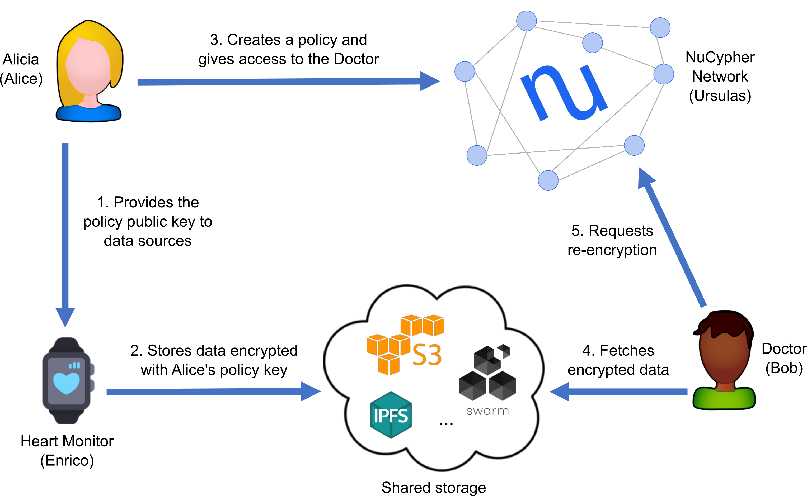

# NuCypher's Heartbeat Demos

Alicia has a Heart Monitor device that measures her heart rate and outputs this data in encrypted form.
Since Alicia knows that she may want to share this data in the future, she uses NuCypher to create
a _policy public key_ for her Heart Monitor to use, so she can read and delegate access to the encrypted
data as she sees fit.

The Heart Monitor uses this public key to produce a file with some amount of encrypted heart rate measurements. 
This file is uploaded to a storage layer (e.g., IPFS, S3, or whatever you choose).

At some future point, she wants to share this information with other people, such as her Doctor.
Once she obtains her Doctor's public keys, she can create a policy in the NuCypher network granting access to him.
After this, her Doctor can read the file with encrypted data (which was uploaded by the Heart Monitor) and
request a re-encrypted ciphertext for each measurement, which can be decrypted with the Doctor's private key.

This simple example showcases many interesting and distinctive aspects of NuCypher:

- Alicia can create policy public keys **before knowing** the potential consumers.
- Alicia, or anyone knowing the policy public key (e.g., the Heart Monitor),
  can produce encrypted data that belongs to the policy.
  Again, this can happen **before granting access** to any consumer.
- As a consequence of the previous point, the Heart Monitor is completely
  unaware of the recipients. In its mind, it's producing data **for Alicia**.
- Alicia never interacts with the Doctor: she only needs the Doctor's public keys.
- Alicia only interacts with the NuCypher network for granting access to the Doctor.
  After this, she can even disappear from the face of the Earth.
- The Doctor never interacts with Alicia or the Heart Monitor and only needs the encrypted data and 
some policy metadata.
  
  
### Running the Demos

#### Install nucypher
Each demo requires a connection to a running `nucypher` network. See 
the [development installation guide](http://docs.nucypher.com/en/latest/guides/installation_guide.html#pipenv-development-installation).

#### Run Local Development Fleet
By default the demos are hardcoded to connect to a local development fleet of ursula nodes. For the demos, you can run 
either a single node, in which case m-of-n can only be 1-of-1 **OR** you can run a fleet of nodes where m,n can be 
greater than 1. See [local fleet instructions](https://docs.nucypher.com/en/latest/demos/local_fleet_demo.html) 
for more information.
