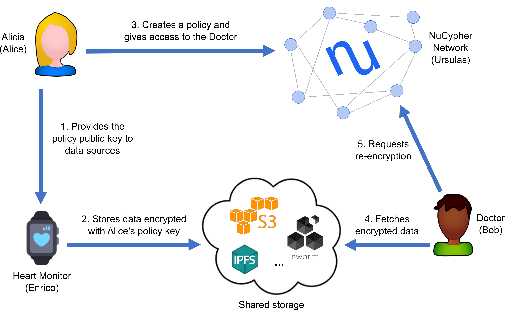

# NuCypher's Heartbeat Demo



Alicia has a Heart Monitor device that measures her heart rate and outputs this data in encrypted form. Since she 
thinks that she may want to share this data in the future, she uses NuCypher to create a _policy public key_ for the 
Heart Monitor to use, so she can read and delegate access to the encrypted data as she sees fit. The Heart Monitor 
uses this public key to produce a database with some amount of encrypted heart rate measurements; this database can 
be located on some storage service (e.g., IPFS, S3, whatever). 

At some moment, she wants to share this information with other people, such as her Doctor. Once she obtains her 
Doctor's public keys, she can create a policy in the NuCypher network granting access to him. After this, her Doctor 
can read the encrypted database (which was populated by the Heart Monitor) and request a re-encrypted ciphertext for 
each measurement, which can be opened with the Doctor's private key.

This simple use case showcases many interesting and distinctive aspects of NuCypher:
  - Alicia can create policy public keys **before knowing** who can be the potential consumers.
  - Alicia, or any one knowing the policy public key (e.g., the Heart Monitor), can produce encrypted data that belongs 
  to the policy. Again, this can happen before granting access to any consumer.
  - As a consequence of the previous point, Data Sources, like the Heart Monitor, are completely unaware of the 
  recipients. In their mind, they are producing data **for Alicia**.
  - Alicia never interacts with the Doctor: she only needs the Doctor's public key.
  - Alicia only interacts with the NuCypher network for granting access to the Doctor. After this, she can even 
  disappear from the face of the Earth.
  - The Doctor never interacts with Alicia or the Heart Monitor: he only needs the encrypted data and some policy metadata.

### How to run the demo
#### Installation of nucypher
See the [installation guide](http://docs.nucypher.com/en/latest/guides/installation_guide.html) for nucypher.

#### Run local node/fleet of nodes
Install dependencies (only for the first time): <http://docs.nucypher.com/en/latest/guides/installation_guide.html#pipenv-development-installation>

(After previously running `pipenv shell`)
For the demo you can run either a single node, in which case m-of-n can only be 1-of-1 **OR** you can run a fleet 
of nodes where m,n can be greater than 1. See [local fleet instructions](https://docs.nucypher.com/en/latest/demos/local_fleet_demo.html) 
for more information.

#### Run the demo
Assuming you already have `nucypher` installed and a local demo fleet of Ursulas deployed:

(After previously running `pipenv shell`)
```sh
(nucypher)$ python examples/heartbeat_demo_ui/streaming_heartbeat.py
```

* You can interact with the demo at [http://127.0.0.1:8050/](http://127.0.0.1:8050/)
    * Multiple `Bobs` can be created by repeatedly opening the Bob link in a new tab.
