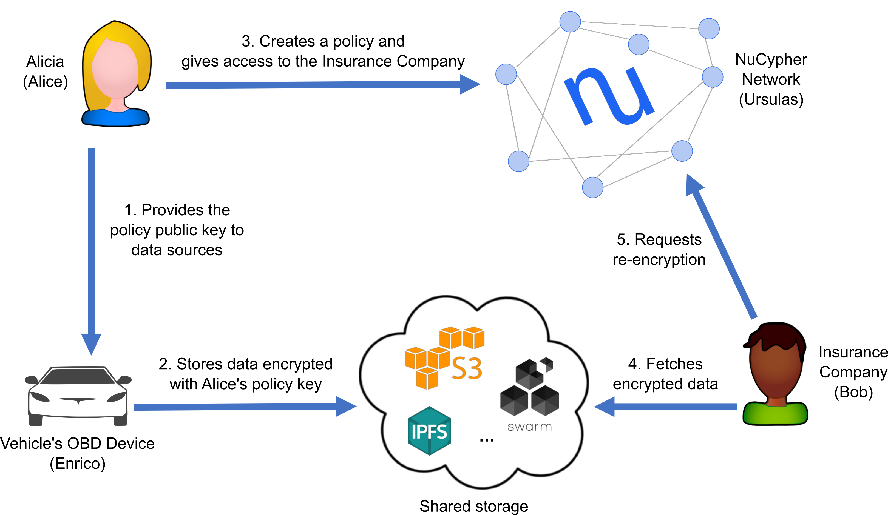

# NuCypher's Vehicle Data Demo



Alicia has a vehicle with a on-board diagnostics (OBD) device that measure various components and outputs this data 
in encrypted form. Since she thinks that she may want to share this data in the future, she uses NuCypher to create 
a _policy public key_ for the OBD device to use, so she can read and delegate access to the encrypted data as she 
sees fit. The OBD device uses this public key to produce a database with some amount of encrypted sensor measurements; 
this database can be located on some storage service (e.g., IPFS, S3, whatever). 

At some point, she wants to share this information with other people, such as her Insurance company (Bob). Once she 
obtains her Insurer's public keys, she can create a policy in the NuCypher network to grant access to him. After 
this, her Insurer can read the encrypted database (which was populated by the OBD device) and request a re-encrypted 
ciphertext for each measurement, which can be opened with the Insurer's private key.

This simple use case showcases many interesting and distinctive aspects of NuCypher:
  - Alicia can create policy public keys **before knowing** who can be the potential consumers.
  - Alicia, or anyone entity the policy public key (e.g., the OBD device), can produce encrypted data that belongs 
  to the policy. Again, this can happen before granting access to any consumer.
  - As a consequence of the previous point, Data Sources, like the OBD device, are completely unaware of the 
  recipients. In their mind, they are producing data **for Alicia**.
  - Alicia never interacts with the Insurer: she only needs the Insurer's public key.
  - Alicia only interacts with the NuCypher network for granting access to the Insurer. After this, she can even 
  disappear from the face of the Earth.
  - The Insurer never interacts with Alicia or the OBD device: he only needs the encrypted data and some policy 
  metadata.

### How to run the demo
#### Installation of nucypher
See the [installation guide](http://docs.nucypher.com/en/latest/guides/installation_guide.html) for nucypher.

#### Run local node/fleet of nodes
Install dependencies (only for the first time): <http://docs.nucypher.com/en/latest/guides/installation_guide.html#pipenv-development-installation>

(After previously running `pipenv shell`)
For the demo you can run either a single node, in which case m-of-n can only be 1-of-1 **OR** you can run a fleet 
of nodes where m,n can be greater than 1. See [local fleet instructions](https://docs.nucypher.com/en/latest/demos/local_fleet_demo.html) 
for more information.

#### Run the demo
Assuming you already have `nucypher` installed and a local demo fleet of Ursulas deployed:

(After previously running `pipenv shell`)
Start the demo:
```sh
(nucypher)$ python examples/vehicle_data_exchange/vehicle_data_exchange.py
```

* You can interact with the demo at [http://127.0.0.1:8050/](http://127.0.0.1:8050/)
    * Multiple `Bobs` can be created by repeatedly opening the Bob link in a new tab.

