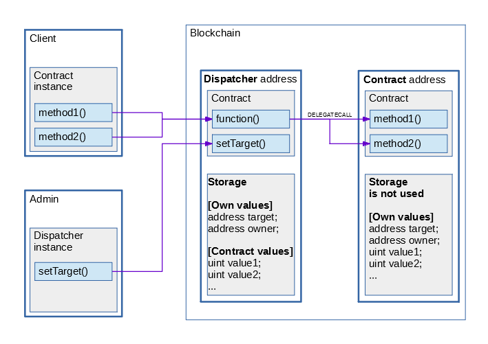

# Upgradeable contracts
Smart contracts in Ethereum are not really changeable. Even it can not be deleted - contract still exists in blockchain after `selfdestruct` (only storage cleared).  
So fixing bugs and upgrading logic is to change contract (address) and save previous storage values.  
Simple way for this is to create new contract, then copy storage there and destruct (mark as deleted) old contract.
But in this case client should change address for requested contract and also while migration will be active two versions of contract.  
More convenient way is to use proxy contract with interface where each method redirect to the target contract.
It's good option because client uses one address most of the time but also have some minus - when we should add some methods then need to change proxy address too.  
Another way is using fallback function in proxy contract - this function will execute on any request, redirect request to target and return result value (using some opcodes).
Almost like previous option, but this proxy doesn't have interface methods, only fallback function, so no need to change proxy address if we should change methods.  
This way is not ideal and has some restrictions (here only major):
* Sending Ether from client's account to contract uses fallback function. Such transaction could consume only 2300 gas (http://solidity.readthedocs.io/en/develop/contracts.html#fallback-function)
* Proxy contract (Dispatcher) holds storage (not in the contract itself). While upgrading storage values should be the same or equivalent (see below)

# Sources
More examples:
* https://github.com/maraoz/solidity-proxy - good realization of using libraries (not contracts) but too complex and some ideas is obsolete after Byzantium hard fork
* https://github.com/willjgriff/solidity-playground - most of the upgradeable code taken from this repository
* https://github.com/0v1se/contracts-upgradeable - almost the same but also have code for verifying upgrade

# Interaction scheme

* Dispatcher - proxy contract that redirects requests to the target address.
Also it clearly holds own values (owner and target address) and stores the values of the target contract but not explicitly.
Client should use result contract or interface ABI while sending request to the Dispatcher address.
Owner can change target address by using Dispatcher ABI.
Dispatcher contract uses `delegatecall` for redirecting requests, so msg.sender remains client address and uses storage from dispatcher when executing method in target contract.
If target address is not set or target contract is not exists result may be unpredictable, because `delegatecall` will return true.
* Contract - upgradeable contract, each version should have same order of storage values.
New versions of contract can expand values, but must contain all old values (first of all should contain values from dispatcher).
This contract is like library because it's storage is not used.
If client send request to the contract without using dispatcher then request could be executed without exception
but using wrong target address (should be dispatcher address) and wrong storage (should be dispatcher storage).
* Government - contract that organizes voting for upgrade of contracts and carries out this update.

# Interaction order
* Admin creates contract_v1 and creates dispatcher using contract_v1 address
* Client instantiates contract_v1 using dispatcher address and sends requests
* Admin or any client creates contract_v2 and creates voting in the government contract
* All clients vote for or against upgrade during the voting time
* After successful voting admin or any client commits upgrade in the government contract
* Client uses old instance without changing (if the methods are not changed)

# Development
* Use Upgradeable as base contract for all contracts that will be used with Dispatcher
* Implement `verifyState(address)` method which checks that new version has correct storage
* Implement `finishUpgrade(address)` method which should copy initialization data from library storage to the dispatcher storage 
* Each upgrade should include tests which check storage equivalence

# TODO
* Fix return size from `delegatecall` in Dispatcher after eth-testrpc will include Byzantium hard fork.